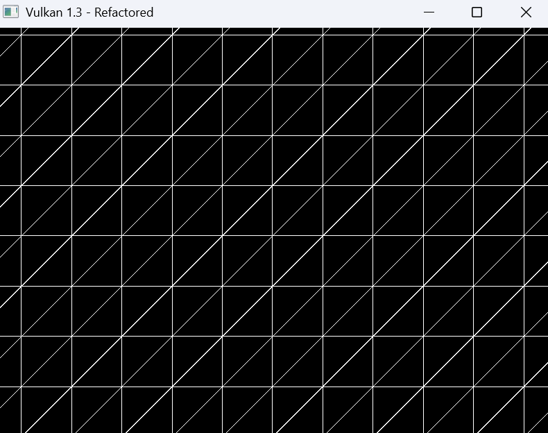
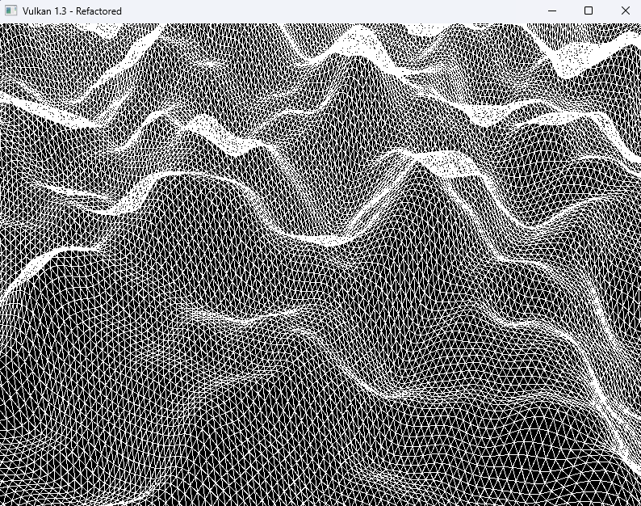
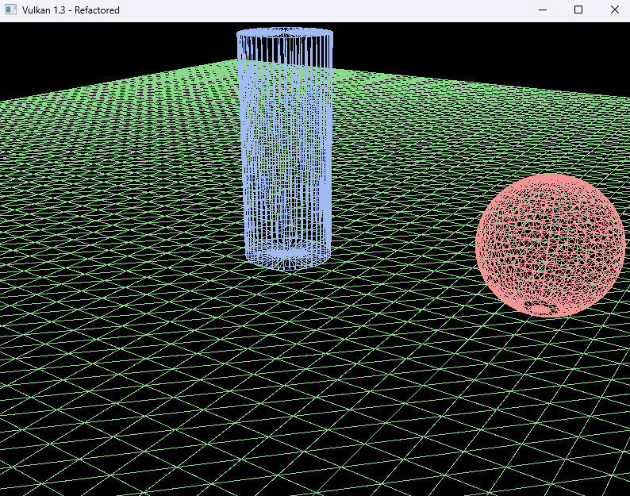

# Vulkan Lab 1 - Complex Shapes
## Week 3 - Lab A


### EXERCISE 1: CREATE A FLAT GRID
####  Generate the vertices and indices for a flat grid of arbitrary width and depth, centred at the origin, and render it in wireframe.

**Solution:**
```c++
void createGrid(int width, int depth, std::vector<Vertex>& outVertices, std::vector<uint32_t>& outIndices) {
    for (int z = 0; z <= depth; ++z) {
        for (int x = 0; x <= width; ++x) {
            Vertex v;
            v.pos = glm::vec3(x - width / 2.0f, 0.0f, z - depth / 2.0f);
            v.color = glm::vec3(1.0f); // white
            outVertices.push_back(v);
        }
    }

    for (int z = 0; z < depth; ++z) {
        for (int x = 0; x < width; ++x) {
            int start = z * (width + 1) + x;
            outIndices.push_back(start);
            outIndices.push_back(start + 1);
            outIndices.push_back(start + width + 1);

            outIndices.push_back(start + 1);
            outIndices.push_back(start + width + 2);
            outIndices.push_back(start + width + 1);
        }
    }
}

```

```c++
void loadModel() {
    createGrid(20, 20, vertices, indices); 
}
```

```c++
ubo.view = glm::lookAt(glm::vec3(0.0f, 10.0f, 0.0f), glm::vec3(0.0f, 0.0f, 0.0f), glm::vec3(0.0f, 0.0f, 1.0f));
```
**Output:**


**Reflection:**
When I followed the implementation steps, then angle I was looking at the grid was too steep, and didn't match the one showed in the example image.
I fixed this by changing lookat function until the output matched the example image. I also had to modify all the buffer sizes to use uint32_t instead of uint16_t, 
as that's what the example code used for the parameters of the grid

### EXERCISE 2: CREATE A WAVY TERRAIN
#### Goal:  Modify the grid generation logic to create a simple, wavy terrain.

**Solution:**
```c++
// Perlin noise helper functions
float fade(float t) { return t * t * t * (t * (t * 6 - 15) + 10); }
float lerp(float a, float b, float t) { return a + t * (b - a); }
float grad(int hash, float x, float y) {
    int h = hash & 7; 
    float u = h < 4 ? x : y;
    float v = h < 4 ? y : x;
    return ((h & 1) ? -u : u) + ((h & 2) ? -v : v);
}

float perlin(float x, float y) {
    static int p[512];
    static bool initialized = false;
    if (!initialized) {
        // Standard permutation table
        int permutation[256] = {
            151,160,137,91,90,15,131,13,201,95,96,53,194,233,7,225,
            140,36,103,30,69,142,8,99,37,240,21,10,23,190,6,148,
            247,120,234,75,0,26,197,62,94,252,219,203,117,35,11,32,
            57,177,33,88,237,149,56,87,174,20,125,136,171,168,68,175,
            74,165,71,134,139,48,27,166,77,146,158,231,83,111,229,122,
            60,211,133,230,220,105,92,41,55,46,245,40,244,102,143,54,
            65,25,63,161,1,216,80,73,209,76,132,187,208,89,18,169,
            200,196,135,130,116,188,159,86,164,100,109,198,173,186,3,64,
            52,217,226,250,124,123,5,202,38,147,118,126,255,82,85,212,
            207,206,59,227,47,16,58,17,182,189,28,42,223,183,170,213,
            119,248,152,2,44,154,163,70,221,153,101,155,167,43,172,9,
            129,22,39,253,19,98,108,110,79,113,224,232,178,185,112,104,
            218,246,97,228,251,34,242,193,238,210,144,12,191,179,162,241,
            81,51,145,235,249,14,239,107,49,192,214,31,181,199,106,157,
            184,84,204,176,115,121,50,45,127,4,150,254,138,236,205,93,
            222,114,67,29,24,72,243,141,128,195,78,66,215,61,156,180
        };
        for (int i = 0; i < 256; i++) p[256 + i] = p[i] = permutation[i];
        initialized = true;
    }

    int X = (int)floor(x) & 255;
    int Y = (int)floor(y) & 255;

    x -= floor(x);
    y -= floor(y);

    float u = fade(x);
    float v = fade(y);

    int A = p[X] + Y;
    int B = p[X + 1] + Y;

    return lerp(
        lerp(grad(p[A], x, y), grad(p[B], x - 1, y), u),
        lerp(grad(p[A + 1], x, y - 1), grad(p[B + 1], x - 1, y - 1), u),
        v);
}
```
```c++
// Terrain generator using Perlin noise
static void createTerrain(
    int width, int depth,
    float cellSize,
    float amplitude, float freqX, float freqZ,
    float scaleX, float scaleZ,
    std::vector<Vertex>& outVertices,
    std::vector<uint32_t>& outIndices)
{
    outVertices.clear();
    outIndices.clear();
    outVertices.reserve((width + 1) * (depth + 1));
    outIndices.reserve(width * depth * 6);

    const float halfW = 0.5f * width * cellSize;
    const float halfD = 0.5f * depth * cellSize;

    for (int j = 0; j <= depth; ++j) {
        for (int i = 0; i <= width; ++i) {
            float x = -halfW + i * cellSize;
            float z = -halfD + j * cellSize;

            float Xs = (i * cellSize) * scaleX;
            float Zs = (j * cellSize) * scaleZ;

            // Perlin noise-based height
            float y =
                amplitude * (0.6f * perlin(Xs * freqX, Zs * freqZ)
                    + 0.3f * perlin(Xs * freqX * 2.0f, Zs * freqZ * 2.0f)
                    + 0.1f * perlin(Xs * freqX * 4.0f, Zs * freqZ * 4.0f));

            
            outVertices.push_back({ glm::vec3(x, y, z), glm::vec3(1.0f, 1.0f, 1.0f) });
        }
    }

    // Index buffer generation (two triangles per quad)
    auto idx = [&](int ii, int jj) { return (uint32_t)(jj * (width + 1) + ii); };
    for (int j = 0; j < depth; ++j) {
        for (int i = 0; i < width; ++i) {
            uint32_t i0 = idx(i, j);
            uint32_t i1 = idx(i + 1, j);
            uint32_t i2 = idx(i + 1, j + 1);
            uint32_t i3 = idx(i, j + 1);
            outIndices.insert(outIndices.end(), { i0, i1, i2, i0, i2, i3 });
        }
    }
}
```


**Output:**


**Reflection:**
This exercise was quite challenging, as I had to research Perlin noise and understand how to implement it.
But once I understood the concept, it was straightforward to integrate it into the terrain generation function.

### EXERCISE 3: PROCEDURAL CYLINDER
#### Goal: Procedurally generate and render a cylinder mesh.

**Solution:**

```c++
static void createCylinder(
    float radius,
    float height,
    uint32_t segments,
    const glm::vec3& colorBottom,
    const glm::vec3& colorTop,
    std::vector<Vertex>& outVertices,
    std::vector<uint32_t>& outIndices)
{
    const float y0 = -0.5f * height;
    const float y1 = 0.5f * height;
    const float TWO_PI = 6.28318530718f;
    const uint32_t RESTART = 0xFFFFFFFFu;

    // Interleave bottom/top ring vertices 
    for (uint32_t i = 0; i < segments; ++i) {
        float a = TWO_PI * (float)i / (float)segments;
        float c = std::cos(a), s = std::sin(a);
        outVertices.push_back({ glm::vec3(radius * c, y0, radius * s), colorBottom });
        outVertices.push_back({ glm::vec3(radius * c, y1, radius * s), colorTop });
    }

    // Add centers
    uint32_t bottomCenter = UINT32_MAX;
    uint32_t topCenter = UINT32_MAX;

    bottomCenter = (uint32_t)outVertices.size();
    outVertices.push_back({ glm::vec3(0.f, y0, 0.f), colorBottom });


    topCenter = (uint32_t)outVertices.size();
    outVertices.push_back({ glm::vec3(0.f, y1, 0.f), colorTop });

    auto idxB = [&](uint32_t i) { return 2u * (i % segments) + 0u; };
    auto idxT = [&](uint32_t i) { return 2u * (i % segments) + 1u; };


    for (uint32_t i = 0; i < segments; ++i) {
        outIndices.push_back(bottomCenter);
        outIndices.push_back(idxB(i));
        outIndices.push_back(idxB(i + 1));
        outIndices.push_back(RESTART);
    }

    // Wall
    for (uint32_t i = 0; i <= segments; ++i) {
        outIndices.push_back(idxB(i));
        outIndices.push_back(idxT(i));
    }
    outIndices.push_back(RESTART);

    for (uint32_t i = 0; i < segments; ++i) {
        outIndices.push_back(topCenter);
        outIndices.push_back(idxT(i));
        outIndices.push_back(idxT(i + 1));
        outIndices.push_back(RESTART);
    }
}

void loadModel() {
    createCylinder(
        1.0f,
        2.0f,
        6,
        glm::vec3(1, 1, 1),
         glm::vec3(1, 1, 1),
        vertices, indices
    );
}
```
```c++
    inputAssembly.topology = VK_PRIMITIVE_TOPOLOGY_TRIANGLE_STRIP;
    inputAssembly.primitiveRestartEnable = VK_TRUE;
```

**Output:**
1. Solid cylinder


2. Wireframe cylinder


At first my understanding was I had to create individual layers for the cylinder and place them on top of each other,
but upon further exploration I found out that I just needed one triangle strip which would wrap around back to the starting
index. The next breakthrough was realising I can just repeat the same process for the top and bottom faces of the cylinder.
All I now needed was a center vertex for both the top and bottom faces, and connect them to the respective ring of vertices.

**Question:**
I saw you call the "RESTART INDEX" without enabling it in the lecture and and you mentioned you wanted us to use this in our function,
but all my research stated, I had to set that value based on the VkIndexType being used.


### EXERCISE 4:  WIREFRAME RENDERING
#### Goal: Refactor the procedural generation code into a reusable C++ class or namespace, similar to the GeometryGenerator provided at d3d12book/Chapter 7 Drawing in Direct3D 
#### Part II at master · d3dcoder/d3d12book using the procedural geometric models defined in GeometryGenerator.h, GeometryGenerator.cp

**Solution:**
```c++

```
**Output:**


**Reflection:**
This solution has brought a lot of clarity to my understanding of how to structure code in a more modular and reusable way. 
By encapsulating the geometry generation logic within a dedicated class, I've made it easier to manage and extend the functionality in the future.
The most difficult part was integrating each individual object into a single vertex and index buffer, as I had to keep track of the offsets for each object.
I was able to keep track of the offsets by storing the current size of the vertex and index buffers before adding a new object, and then using those sizes 
as the offsets for the new object's vertices and indices. When placing objects in a scene I had to learn how to keep everything flat on the XZ plane, by
setting the Y coordinate to 0. This seems obviosuos now, but I initially struggled with it. I also had a problem with the scaling I used, I was intially
using a scale of 1.8f for everything, but this made the objects too large, whilst also distorting the sphere, causing it to look oblong,
and they were clipping through the near plane of the camera, so I had to reduce the scale to 1.0f which fixed both issues. At the start of the exercise I was


### EXERCISE 5: LOADING EXTERNAL MODELS WITH ASSIMP
#### Goal: Integrate the Assimp library into your project to load and render a 3D model from an .obj file.

**Solution:**

```c++
```
```c++
```


**Reflection:**


