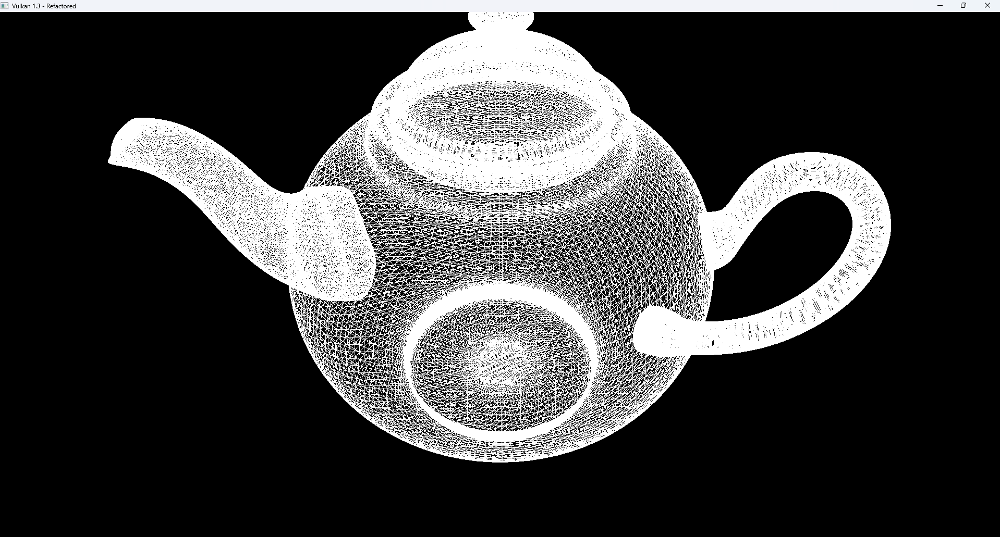

# Vulkan Lab 2 - Complex Shapes
## Week 3 - Lab A

### EXERCISE 1: CREATE A FLAT GRID
####  Generate the vertices and indices for a flat grid of arbitrary width and depth, centred at the origin, and render it in wireframe.

**Solution:**
I generated a flat grid by computing vertex positions in a double loop across the X and Z axes, centering them around the origin. The indices were created to connect each quad of four vertices into two triangles, forming the grid surface. After rendering it in wireframe, I found the viewing angle was too steep, so I modified the glm::lookAt camera parameters until it matched the example image. I also adjusted the buffer definitions to use uint32_t instead of uint16_t, which resolved parameter and rendering issues in the example code.

```c++
void createGrid(int width, int depth, std::vector<Vertex>& outVertices, std::vector<uint32_t>& outIndices) {
    for (int z = 0; z <= depth; ++z) {
        for (int x = 0; x <= width; ++x) {
            Vertex v;
            v.pos = glm::vec3(x - width / 2.0f, 0.0f, z - depth / 2.0f);
            v.color = glm::vec3(1.0f); // white
            outVertices.push_back(v);
        }
    }

    for (int z = 0; z < depth; ++z) {
        for (int x = 0; x < width; ++x) {
            int start = z * (width + 1) + x;
            outIndices.push_back(start);
            outIndices.push_back(start + 1);
            outIndices.push_back(start + width + 1);

            outIndices.push_back(start + 1);
            outIndices.push_back(start + width + 2);
            outIndices.push_back(start + width + 1);
        }
    }
}

```

```c++
void loadModel() {
    createGrid(20, 20, vertices, indices); 
}
```

```c++
ubo.view = glm::lookAt(glm::vec3(0.0f, 10.0f, 0.0f), glm::vec3(0.0f, 0.0f, 0.0f), glm::vec3(0.0f, 0.0f, 1.0f));
```
**Output:**


**Reflection:**
When I followed the implementation steps, then angle I was looking at the grid was too steep, and didn't match the one showed in the example image.
I fixed this by changing lookat function until the output matched the example image. I also had to modify all the buffer sizes to use uint32_t instead of uint16_t, 
as that's what the example code used for the parameters of the grid

---
### EXERCISE 2: CREATE A WAVY TERRAIN
#### Goal:  Modify the grid generation logic to create a simple, wavy terrain.

**Solution:**
I extended the grid generation logic to produce a wavy terrain using Perlin noise. To achieve this, I implemented helper functions for smoothing and interpolation (fade, lerp, and grad) and then built the Perlin noise algorithm to generate coherent height variations across the surface. I combined multiple frequencies (octaves) of noise to create more natural variation and scaled the amplitude to control the terrain height. Once the height values were applied to the Y-axis of each vertex, the output formed a smooth, realistic wavy surface. I experimented with the amplitude and frequency to channge the appearance of the terrain, ans eventually settled on the values used below. 

```c++
// Perlin noise helper functions
float fade(float t) { return t * t * t * (t * (t * 6 - 15) + 10); }
float lerp(float a, float b, float t) { return a + t * (b - a); }
float grad(int hash, float x, float y) {
    int h = hash & 7; 
    float u = h < 4 ? x : y;
    float v = h < 4 ? y : x;
    return ((h & 1) ? -u : u) + ((h & 2) ? -v : v);
}

float perlin(float x, float y) {
    static int p[512];
    static bool initialized = false;
    if (!initialized) {
        // Standard permutation table
        int permutation[256] = {
            151,160,137,91,90,15,131,13,201,95,96,53,194,233,7,225,
            140,36,103,30,69,142,8,99,37,240,21,10,23,190,6,148,
            247,120,234,75,0,26,197,62,94,252,219,203,117,35,11,32,
            57,177,33,88,237,149,56,87,174,20,125,136,171,168,68,175,
            74,165,71,134,139,48,27,166,77,146,158,231,83,111,229,122,
            60,211,133,230,220,105,92,41,55,46,245,40,244,102,143,54,
            65,25,63,161,1,216,80,73,209,76,132,187,208,89,18,169,
            200,196,135,130,116,188,159,86,164,100,109,198,173,186,3,64,
            52,217,226,250,124,123,5,202,38,147,118,126,255,82,85,212,
            207,206,59,227,47,16,58,17,182,189,28,42,223,183,170,213,
            119,248,152,2,44,154,163,70,221,153,101,155,167,43,172,9,
            129,22,39,253,19,98,108,110,79,113,224,232,178,185,112,104,
            218,246,97,228,251,34,242,193,238,210,144,12,191,179,162,241,
            81,51,145,235,249,14,239,107,49,192,214,31,181,199,106,157,
            184,84,204,176,115,121,50,45,127,4,150,254,138,236,205,93,
            222,114,67,29,24,72,243,141,128,195,78,66,215,61,156,180
        };
        for (int i = 0; i < 256; i++) p[256 + i] = p[i] = permutation[i];
        initialized = true;
    }

    int X = (int)floor(x) & 255;
    int Y = (int)floor(y) & 255;

    x -= floor(x);
    y -= floor(y);

    float u = fade(x);
    float v = fade(y);

    int A = p[X] + Y;
    int B = p[X + 1] + Y;

    return lerp(
        lerp(grad(p[A], x, y), grad(p[B], x - 1, y), u),
        lerp(grad(p[A + 1], x, y - 1), grad(p[B + 1], x - 1, y - 1), u),
        v);
}
```
```c++
// Terrain generator using Perlin noise
static void createTerrain(
    int width, int depth,
    float cellSize,
    float amplitude, float freqX, float freqZ,
    float scaleX, float scaleZ,
    std::vector<Vertex>& outVertices,
    std::vector<uint32_t>& outIndices)
{
    outVertices.clear();
    outIndices.clear();
    outVertices.reserve((width + 1) * (depth + 1));
    outIndices.reserve(width * depth * 6);

    const float halfW = 0.5f * width * cellSize;
    const float halfD = 0.5f * depth * cellSize;

    for (int j = 0; j <= depth; ++j) {
        for (int i = 0; i <= width; ++i) {
            float x = -halfW + i * cellSize;
            float z = -halfD + j * cellSize;

            float Xs = (i * cellSize) * scaleX;
            float Zs = (j * cellSize) * scaleZ;

            // Perlin noise-based height
            float y =
                amplitude * (0.6f * perlin(Xs * freqX, Zs * freqZ)
                    + 0.3f * perlin(Xs * freqX * 2.0f, Zs * freqZ * 2.0f)
                    + 0.1f * perlin(Xs * freqX * 4.0f, Zs * freqZ * 4.0f));

            
            outVertices.push_back({ glm::vec3(x, y, z), glm::vec3(1.0f, 1.0f, 1.0f) });
        }
    }

    // Index buffer generation (two triangles per quad)
    auto idx = [&](int ii, int jj) { return (uint32_t)(jj * (width + 1) + ii); };
    for (int j = 0; j < depth; ++j) {
        for (int i = 0; i < width; ++i) {
            uint32_t i0 = idx(i, j);
            uint32_t i1 = idx(i + 1, j);
            uint32_t i2 = idx(i + 1, j + 1);
            uint32_t i3 = idx(i, j + 1);
            outIndices.insert(outIndices.end(), { i0, i1, i2, i0, i2, i3 });
        }
    }
}
```

```c++
void loadModel() {
    createTerrain(
        200, 200,            
        0.1f,                
        1.2f,                
        1.5f, 1.5f,         
        0.25f, 0.25f,        
        vertices, indices
    );
}
```


**Output:**


**Reflection:**
This exercise was quite challenging, as I had to research Perlin noise and understand how to implement it. But once I understood the concept, it was straightforward to integrate it into the terrain generation function. I decided to use the perlin noise implementation over a simple math function, as it produced a more natural-looking terrain. I also had to adjust the frequency and amplitude parameters to get it looking right.

**References:**
- good (2016). Computer Graphics Stack Exchange. [online] Computer Graphics Stack Exchange. Available at: https://computergraphics.stackexchange.com/questions/1959/what-makes-a-good-permutation-table.

---
### EXERCISE 3: PROCEDURAL CYLINDER
#### Goal: Procedurally generate and render a cylinder mesh.

**Solution:**
For the cylinder, I generated two rings of vertices, one for the top and one for the bottom, using trigonometric functions to position points evenly around a circle. I then connected these rings using triangle strips and added a center vertex for both the top and bottom faces. To allow Vulkan to correctly separate the faces, I used a restart index (0xFFFFFFFF) and enabled VK_PRIMITIVE_TOPOLOGY_TRIANGLE_STRIP. Initially, I thought I needed to stack multiple circular layers, but I later realized that a single triangle strip looping back to the starting point produced the correct cylindrical shape.

```c++
static void createCylinder(
    float radius,
    float height,
    uint32_t segments,
    const glm::vec3& colorBottom,
    const glm::vec3& colorTop,
    std::vector<Vertex>& outVertices,
    std::vector<uint32_t>& outIndices)
{
    const float y0 = -0.5f * height;
    const float y1 = 0.5f * height;
    const float TWO_PI = 6.28318530718f;
    const uint32_t RESTART = 0xFFFFFFFFu;

    // Interleave bottom/top ring vertices 
    for (uint32_t i = 0; i < segments; ++i) {
        float a = TWO_PI * (float)i / (float)segments;
        float c = std::cos(a), s = std::sin(a);
        outVertices.push_back({ glm::vec3(radius * c, y0, radius * s), colorBottom });
        outVertices.push_back({ glm::vec3(radius * c, y1, radius * s), colorTop });
    }

    uint32_t bottomCenter = UINT32_MAX;
    uint32_t topCenter = UINT32_MAX;

    bottomCenter = (uint32_t)outVertices.size();
    outVertices.push_back({ glm::vec3(0.f, y0, 0.f), colorBottom });


    topCenter = (uint32_t)outVertices.size();
    outVertices.push_back({ glm::vec3(0.f, y1, 0.f), colorTop });

    auto idxB = [&](uint32_t i) { return 2u * (i % segments) + 0u; };
    auto idxT = [&](uint32_t i) { return 2u * (i % segments) + 1u; };


    for (uint32_t i = 0; i < segments; ++i) {
        outIndices.push_back(bottomCenter);
        outIndices.push_back(idxB(i));
        outIndices.push_back(idxB(i + 1));
        outIndices.push_back(RESTART);
    }

    for (uint32_t i = 0; i <= segments; ++i) {
        outIndices.push_back(idxB(i));
        outIndices.push_back(idxT(i));
    }
    outIndices.push_back(RESTART);

    for (uint32_t i = 0; i < segments; ++i) {
        outIndices.push_back(topCenter);
        outIndices.push_back(idxT(i));
        outIndices.push_back(idxT(i + 1));
        outIndices.push_back(RESTART);
    }
}

void loadModel() {
    createCylinder(
        1.0f,
        2.0f,
        6,
        glm::vec3(1, 1, 1),
         glm::vec3(1, 1, 1),
        vertices, indices
    );
}
```
```c++
    inputAssembly.topology = VK_PRIMITIVE_TOPOLOGY_TRIANGLE_STRIP;
    inputAssembly.primitiveRestartEnable = VK_TRUE;
```

**Output:**
1. Solid cylinder


2. Wireframe cylinder


**Reflection:**
At first my understanding was I had to create individual layers for the cylinder and place them on top of each other, but upon further exploration I found out that I just needed one triangle strip which would wrap around back to the starting index. The next breakthrough was realising I can just repeat the same process for the top and bottom faces of the cylinder. All I now needed was a center vertex for both the top and bottom faces, and connect them to the respective ring of vertices. Upon further reflection, it appears, that I may have missed something, thats why the "RESTART_INDEX" wasn't working,
because that RESTART_INDEX function is built in when primitiveRestartEnable is set to True.

**Question:**
I saw you call the "RESTART INDEX" without enabling it in the lecture and and you mentioned you wanted us to use this in our function,
but all my research stated, I had to set that value based on the VkIndexType being used.

---
### EXERCISE 4:  WIREFRAME RENDERING
#### Goal: Refactor the procedural generation code into a reusable C++ class or namespace, similar to the GeometryGenerator provided at Chapter 7 Drawing in Direct3D, Part II using the procedural geometric models defined in GeometryGenerator.h, GeometryGenerator.cp

**Solution:**
I refactored all the procedural geometry generation code into a reusable C++ class, inspired by the GeometryGenerator structure from the Direct3D book. This approach modularized the logic and made it easier to add new procedural shapes in the future. I also integrated all generated shapes into shared vertex and index buffers by tracking offsets for each addition. During testing, I resolved scaling and clipping issues by reducing the overall scale and ensuring all objects were aligned along the XZ plane. Switching from individual triangles to triangle strips after debugging further improved performance and code organisation.

```c++
#pragma once
#include <vector>
#include <cstdint>
#include <cmath>
#include <glm/glm.hpp>

struct Vertex {
    glm::vec3 pos;
    glm::vec3 color;
};

struct MeshData {
    std::vector<Vertex> vertices;
    std::vector<uint32_t> indices;
};

inline constexpr uint32_t RESTART_INDEX = 0xFFFFFFFFu;

inline MeshData createGridStrip(float width, float depth, uint32_t m, uint32_t n, glm::vec3 color) {
    MeshData md;
    md.vertices.reserve(m * n);
    md.indices.reserve((n - 1) * (2 * m + 1));

    const float dx = width / (m - 1);
    const float dz = depth / (n - 1);
    const float x0 = -width * 0.5f;
    const float z0 = -depth * 0.5f;

    for (uint32_t j = 0; j < n; ++j) {
        for (uint32_t i = 0; i < m; ++i) {
            float x = x0 + i * dx;
            float z = z0 + j * dz;
            md.vertices.push_back({ {x, 0.0f, z}, color });
        }
    }

    for (uint32_t j = 0; j < n - 1; ++j) {
        for (uint32_t i = 0; i < m; ++i) {
            uint32_t top = j * m + i;
            uint32_t bot = (j + 1) * m + i;
            md.indices.push_back(top);
            md.indices.push_back(bot);
        }
        md.indices.push_back(RESTART_INDEX);
    }
    return md;
}

inline MeshData createCylinderStrip(float bottomR, float topR, float height,
                                    uint32_t sliceCount, uint32_t stackCount, glm::vec3 color) {
    MeshData md;

    float stackHeight = height / stackCount;
    float radiusStep = (topR - bottomR) / stackCount;

    for (uint32_t i = 0; i <= stackCount; ++i) {
        float y = -0.5f * height + i * stackHeight;
        float r = bottomR + i * radiusStep;
        for (uint32_t j = 0; j <= sliceCount; ++j) {
            float theta = j * 2.0f * 3.1415926535f / sliceCount;
            float x = r * std::cos(theta);
            float z = r * std::sin(theta);
            md.vertices.push_back({ {x, y, z}, color });
        }
    }

    uint32_t ring = sliceCount + 1;
    for (uint32_t i = 0; i < stackCount; ++i) {
        for (uint32_t j = 0; j <= sliceCount; ++j) {
            uint32_t i0 = i * ring + j;
            uint32_t i1 = (i + 1) * ring + j;
            md.indices.push_back(i0);
            md.indices.push_back(i1);
        }
        md.indices.push_back(RESTART_INDEX);
    }

    // Top cap as small strips (center, vj, vj+1)
    uint32_t topCenter = (uint32_t)md.vertices.size();
    md.vertices.push_back({ {0.0f, +0.5f * height, 0.0f}, color });
    uint32_t topRingStart = stackCount * ring;
    for (uint32_t j = 0; j < sliceCount; ++j) {
        md.indices.push_back(topCenter);
        md.indices.push_back(topRingStart + j);
        md.indices.push_back(topRingStart + j + 1);
        md.indices.push_back(RESTART_INDEX);
    }

    // Bottom cap
    uint32_t bottomCenter = (uint32_t)md.vertices.size();
    md.vertices.push_back({ {0.0f, -0.5f * height, 0.0f}, color });
    for (uint32_t j = 0; j < sliceCount; ++j) {
        md.indices.push_back(bottomCenter);
        md.indices.push_back(j + 1);
        md.indices.push_back(j);
        md.indices.push_back(RESTART_INDEX);
    }

    return md;
}

inline MeshData createSphereStrip(float r, uint32_t sliceCount, uint32_t stackCount, glm::vec3 color) {
    MeshData md;
    md.vertices.reserve((sliceCount + 1) * (stackCount - 1) + 2);

    md.vertices.push_back({ {0, +r, 0}, color }); // top

    for (uint32_t i = 1; i <= stackCount - 1; ++i) {
        float phi = 3.1415926535f * i / stackCount;
        float y = r * std::cos(phi);
        float s = r * std::sin(phi);
        for (uint32_t j = 0; j <= sliceCount; ++j) {
            float theta = 2.0f * 3.1415926535f * j / sliceCount;
            float x = s * std::cos(theta);
            float z = s * std::sin(theta);
            md.vertices.push_back({ {x, y, z}, color });
        }
    }

    md.vertices.push_back({ {0, -r, 0}, color }); // bottom

    uint32_t top = 0;
    uint32_t south = (uint32_t)md.vertices.size() - 1;
    uint32_t base = 1;
    uint32_t ring = sliceCount + 1;
    uint32_t interior = (stackCount >= 2 ? stackCount - 2 : 0);

    // top cap
    for (uint32_t j = 0; j < sliceCount; ++j) {
        md.indices.push_back(top);
        md.indices.push_back(base + j);
        md.indices.push_back(base + j + 1);
        md.indices.push_back(RESTART_INDEX);
    }

    // middle bands
    for (uint32_t i = 0; i + 1 < interior; ++i) {
        for (uint32_t j = 0; j <= sliceCount; ++j) {
            uint32_t i0 = base + i * ring + j;
            uint32_t i1 = i0 + ring;
            md.indices.push_back(i0);
            md.indices.push_back(i1);
        }
        md.indices.push_back(RESTART_INDEX);
    }

    // bottom cap
    if (interior > 0) {
        uint32_t lastRingStart = south - ring;
        for (uint32_t j = 0; j < sliceCount; ++j) {
            md.indices.push_back(south);
            md.indices.push_back(lastRingStart + j + 1);
            md.indices.push_back(lastRingStart + j);
            md.indices.push_back(RESTART_INDEX);
        }
    }

    return md;
}

```
```c++
void loadModel()
{
    
    // helper to append a MeshData into one indices and vertices arrray
    auto append = [](const MeshData& m,
                     std::vector<Vertex>& V,
                     std::vector<uint32_t>& I,
                     const glm::mat4& M = glm::mat4(1.0f))
    {
        const uint32_t base = static_cast<uint32_t>(V.size());
        V.reserve(V.size() + m.vertices.size());
        for (const auto& v : m.vertices) {
            glm::vec4 p = M * glm::vec4(v.pos, 1.0f);
            V.push_back(Vertex{ glm::vec3(p), v.color });
        }
        I.reserve(I.size() + m.indices.size() + 1);
        for (uint32_t idx : m.indices) {
            I.push_back(idx == RESTART_INDEX ? RESTART_INDEX : base + idx);
        }
        // separate meshes
        if (!I.empty() && I.back() != RESTART_INDEX) I.push_back(RESTART_INDEX);
    };

    MeshData grid = createGridStrip(30.0f, 30.0f, 80, 80, { 0.25f, 0.70f, 0.25f });
    MeshData cyl  = createCylinderStrip(0.6f, 0.6f, 3.0f, 48, 1, { 0.35f, 0.50f, 0.90f });
    MeshData sph  = createSphereStrip(0.8f, 48, 24, { 0.90f, 0.30f, 0.30f });

    append(grid, vertices, indices);
    append(cyl,  vertices, indices, glm::translate(glm::mat4(1.0f), glm::vec3(-1.8f, 1.5f, 0.0f)));
    append(sph,  vertices, indices, glm::translate(glm::mat4(1.0f), glm::vec3(+1.8f, 0.9f, 0.0f)));
}
```
**Output:**


**Reflection:**
This solution has brought a lot of clarity to my understanding of how to structure code in a more modular and reusable way. 
By encapsulating the geometry generation logic within a dedicated class, I've made it easier to manage and extend the functionality in the future.
The most difficult part was integrating each individual object into a single vertex and index buffer, as I had to keep track of the offsets for each object.
I was able to keep track of the offsets by storing the current size of the vertex and index buffers before adding a new object, and then using those sizes 
as the offsets for the new object's vertices and indices. When placing objects in a scene I had to learn how to keep everything flat on the XZ plane, by
setting the Y coordinate to 0. This seems obviosuos now, but I initially struggled with it. I also had a problem with the scaling I used, I was intially
using a scale of 1.8f for everything, but this made the objects too large, whilst also distorting the sphere, causing it to look oblong,
and they were clipping through the near plane of the camera, so I had to reduce the scale to 1.0f which fixed both issues. At the start of the exercise I was
encountering a lot of error that I didn't understand, so instead of build the objects with a triangle strip, I built them with individual triangles, which 
fixed the errors. Once this was working I refactored the code to use triangle strips, which worked fine. I had some issues on how i was going to build 
the sphere, as I didn't understand how to build it with a triangle strip, so I just I built the sphere using multiple triangle strips with primitive restart, 
not a single giant strip. I duplicate the first slice vertex on each ring (sliceCount + 1 per ring) to close the seam. 
The top and bottom caps are emitted as tiny 3-index strips [pole, vj, vj+1], each followed by a restart. The middle is built as one strip per latitude band,
zig-zagging between adjacent rings and ending with a restart. 

**References:**
- Sergey Kosarevsky, Medvedev, A. and Viktor Latypov (2025). Vulkan 3D Graphics Rendering Cookbook. Packt Publishing Ltd.
- Luna, F. (2011) GeometryGenerator.cpp. [Source code]. Available at: https://github.com/d3dcoder/d3d12book/blob/master/Common/GeometryGenerator.cpp 

---

### EXERCISE 5: LOADING EXTERNAL MODELS WITH ASSIMP
#### Goal: Integrate the Assimp library into your project to load and render a 3D model from an .obj file.

**Solution:**
In this exercise, I set up the structure for integrating the Assimp library to import .obj models into the Vulkan rendering pipeline. The goal was to load external 3D geometry data directly into vertex and index buffers for rendering. Although the implementation was still in progress, I prepared the code framework and verified that the imported data could be mapped into the same rendering structure as the procedural models.

```c++
void loadModel() {
    Assimp::Importer importer;
    const aiScene* scene = importer.ReadFile(
        "C:/Users/984381/source/repos/ChubieMirembe/RTG/Week_3/teapot.obj",
        aiProcess_Triangulate | aiProcess_FlipUVs
    );

    aiMesh* mesh = scene->mMeshes[0];

    vertices.clear();
    indices.clear();

    for (unsigned int i = 0; i < mesh->mNumVertices; i++) {
        Vertex vertex;
        vertex.pos = {
            mesh->mVertices[i].x,
            mesh->mVertices[i].y,
            mesh->mVertices[i].z
        };
        vertex.color = { 1.0f, 1.0f, 1.0f };
        vertices.push_back(vertex);
    }

    for (unsigned int i = 0; i < mesh->mNumFaces; i++) {
        aiFace face = mesh->mFaces[i];
        for (unsigned int j = 0; j < face.mNumIndices; j++) {
            indices.push_back(face.mIndices[j]);
        }
    }

}
```

**Output:**


**Reflection:**
During this exercise, I learnt how to integrate the Assimp library into my Vulkan project. I also found several wesbsite that I was unfamilar with
which provided free 3D models. I also learnt that low pily models are better for real-time rendering, as they have fewer vertices and faces to process.
For this exercise, I wanted to used different objects, but the teapot model was one of the few look still looked good with a low poly count. I also
had to remove the object file from git ignore, because otherwise I wouldn't be able to push the teapot file onto the repository.

**References:**
- printable_models (2018) Brown Betty Teapot v1 [3D model]. Free3D. Available at: https://free3d.com/3d-model/brown-betty-teapot-v1--730417.html
---

### FURTHER EXPLORATION 
```c++
const aiScene* scene = importer.ReadFile(
    "C:/Users/984381/source/repos/ChubieMirembe/RTG/Week_3/teapot.obj",
    aiProcess_Triangulate |
    aiProcess_JoinIdenticalVertices |
    aiProcess_ImproveCacheLocality |
    aiProcess_OptimizeMeshes |
    aiProcess_GenNormals |          
    aiProcess_FlipUVs               
);

```

```c++
void loadModel() {
    Assimp::Importer importer;
    const aiScene* scene = importer.ReadFile(
        "C:/Users/984381/source/repos/ChubieMirembe/RTG/Week_3/teapot.obj",
        aiProcess_Triangulate |
        aiProcess_JoinIdenticalVertices |
        aiProcess_ImproveCacheLocality |
        aiProcess_OptimizeMeshes |
        aiProcess_GenNormals |
        aiProcess_FlipUVs
    );

    if (!scene || !scene->HasMeshes()) {
        throw std::runtime_error(std::string("Assimp load failed: ") + importer.GetErrorString());
    }

    vertices.clear();
    indices.clear();

    // grayscale so you can see them
    auto meshColor = [](unsigned mIdx, unsigned meshCount) -> glm::vec3 {
        float t = meshCount > 1 ? (float)mIdx / (meshCount - 1) : 0.5f;
        return glm::vec3(0.6f + 0.4f * t); 
    };

    for (unsigned m = 0; m < scene->mNumMeshes; ++m) {
        const aiMesh* mesh = scene->mMeshes[m];
        if (!mesh->HasPositions() || !mesh->HasFaces()) continue;

        const uint32_t baseVertex = static_cast<uint32_t>(vertices.size());
        glm::vec3 color = meshColor(m, scene->mNumMeshes);

        vertices.reserve(vertices.size() + mesh->mNumVertices);
        for (unsigned i = 0; i < mesh->mNumVertices; ++i) {
            Vertex v{};
            v.pos   = { mesh->mVertices[i].x, mesh->mVertices[i].y, mesh->mVertices[i].z };
            v.color = color;
            vertices.push_back(v);
        }

        indices.reserve(indices.size() + mesh->mNumFaces * 3);
        for (unsigned f = 0; f < mesh->mNumFaces; ++f) {
            const aiFace& face = mesh->mFaces[f];
            if (face.mNumIndices != 3) continue; 
            indices.push_back(baseVertex + face.mIndices[0]);
            indices.push_back(baseVertex + face.mIndices[1]);
            indices.push_back(baseVertex + face.mIndices[2]);
        }
    }

    if (vertices.empty() || indices.empty()) {
        throw std::runtime_error("Model has no renderable geometry after processing.");
    }
}

```

***Reflection:***
Upon further exploration, I discovered that we don't have to manually handle multiple meshes in a model, as Assimp does this for us. So for future
references, I can just loop through all the meshes in a model and render them one by one. I also found out that Assimp can load many different file formats.

