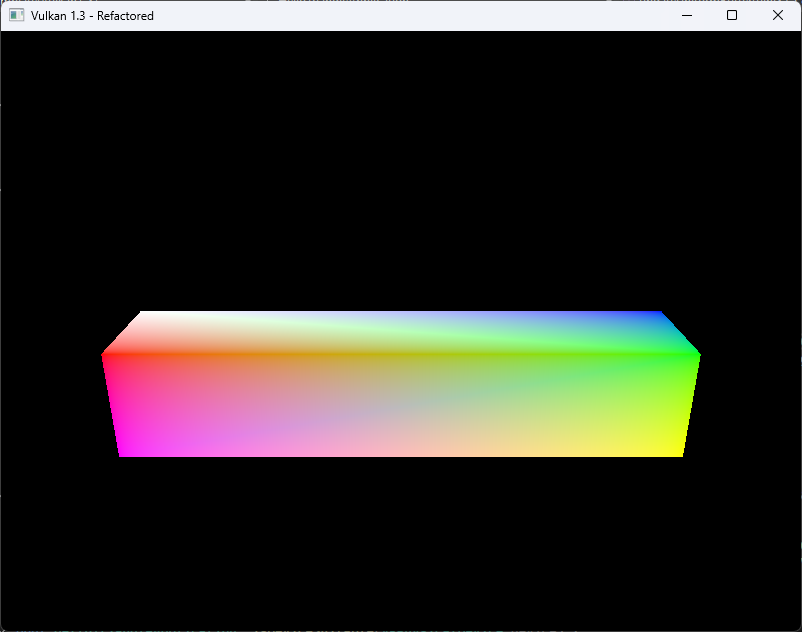
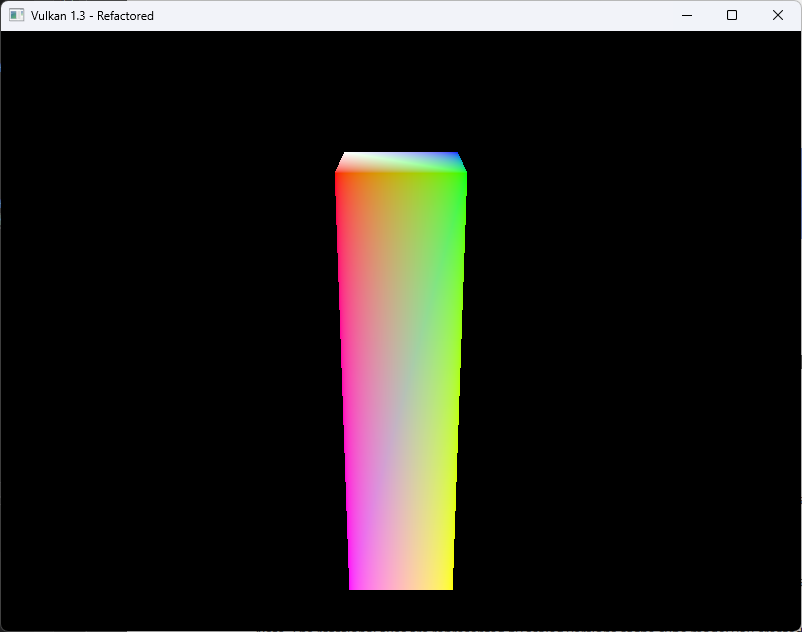
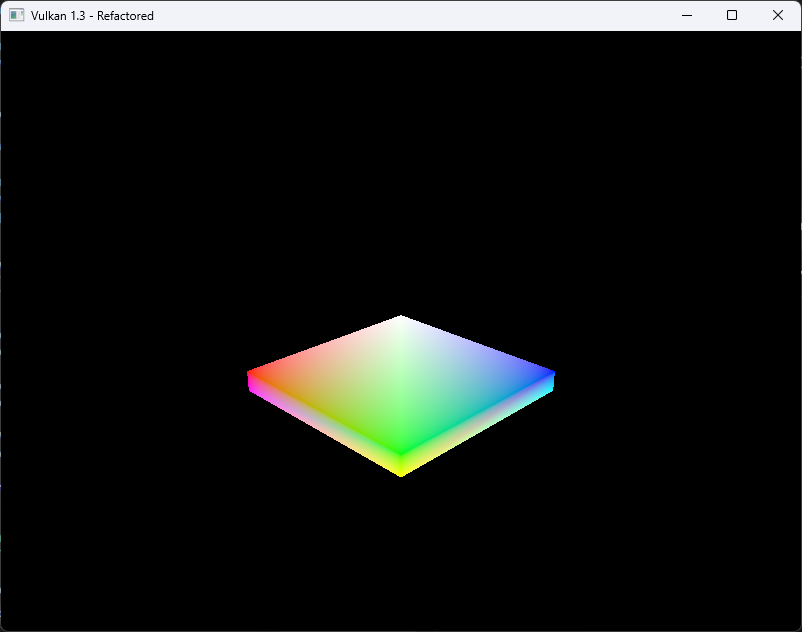
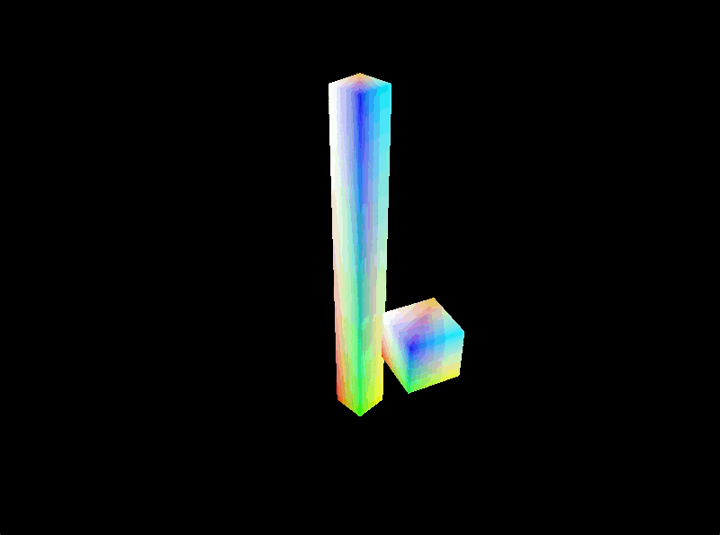
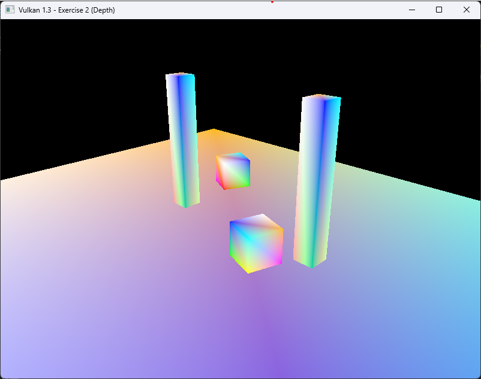
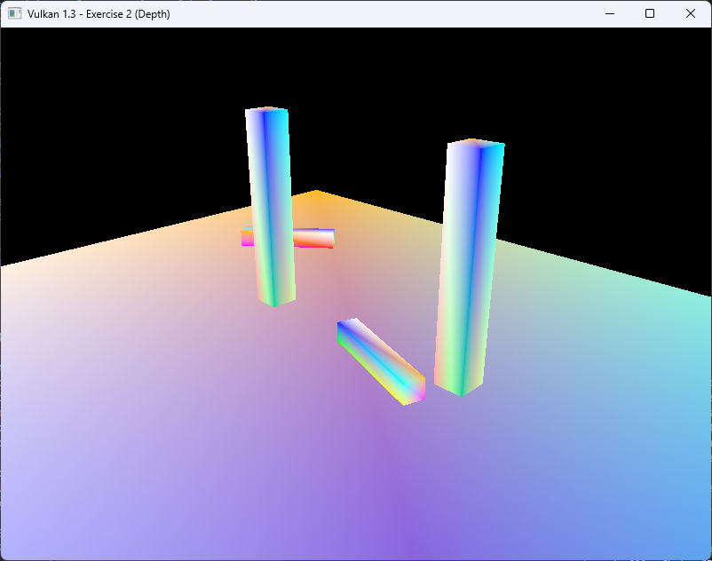
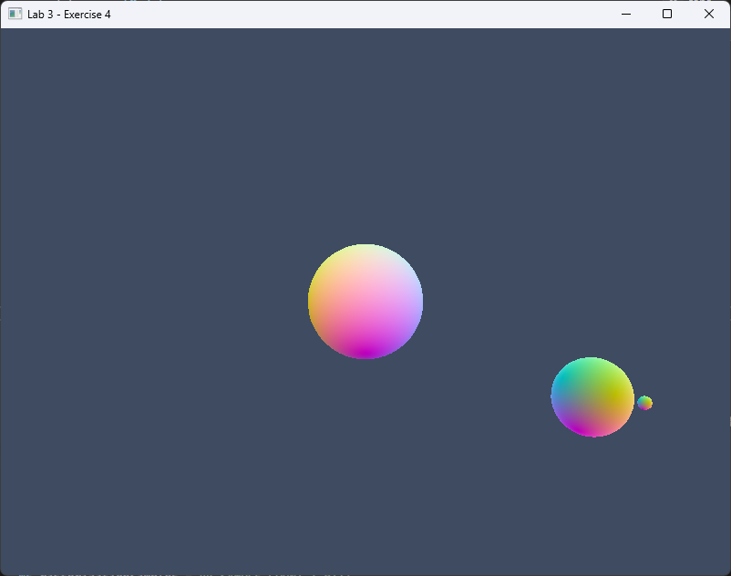
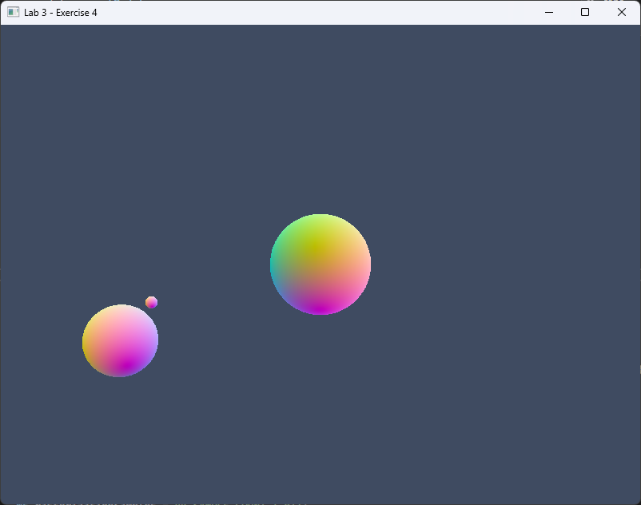

# Vulkan Lab  - Transformations and Coordinate Systems
## Week 4 - Lab A


### EXERCISE 1:BASIC SCALING TRANSFORMATION
#### Deform the cube you created from Lab 1 into a long, flat plank using a non-uniform scaling transformation.

**Solution:**
The solution for the horizontal, was already provided in the lecture. Below are the code snippets for all three views:
I just modified the scale parameters in the model matrix on the different axes to achieve the desired deformation.
For the horizontal view, I scaled the x-axis more than the y and z axes to create a long plank. For the vertical view,
I scaled the z-axis more than the x and y axes to create a tall plank. For the flat view, I scaled the z-axis very little 
compared to the x and y axes to create a flat shape.

1. Horitontal View:
```c++
glm::mat4 modelMatrix = glm::scale(glm::mat4(1.0f), glm::vec3(2.5f, 0.5f, 0.5f));
    glm::mat4 rotate = glm::rotate(glm::mat4(1.0f), glm::radians(90.0f), glm::vec3(0.0f, 0.0f, 1.0f));
    ubo.model = rotate * modelMatrix;
    ubo.view = glm::lookAt(glm::vec3(6.0f, 0.0f, 3.0f), glm::vec3(0.0f, 0.0f, 0.5f), glm::vec3(0.0f, 0.0f, 10.0f));
```

2. Vertical View:
```c++
glm::mat4 modelMatrix = glm::scale(glm::mat4(1.0f), glm::vec3(0.5f, 0.5f, 2.0f));
    glm::mat4 rotate = glm::rotate(glm::mat4(1.0f), glm::radians(90.0f), glm::vec3(0.0f, 0.0f, 1.0f));
    ubo.model = rotate * modelMatrix;
    ubo.view = glm::lookAt(glm::vec3(6.0f, 0.0f, 3.0f), glm::vec3(0.0f, 0.0f, 0.5f), glm::vec3(0.0f, 0.0f, 10.0f));
    ubo.proj = glm::perspective(glm::radians(45.0f), swapChainExtent.width / (float)swapChainExtent.height, 0.1f, 10.0f);
```

3. Flat View:
```c++
UniformBufferObject ubo{};
    glm::mat4 modelMatrix = glm::scale(glm::mat4(1.0f), glm::vec3(1.0f, 1.0f, 0.1f));
    glm::mat4 rotate = glm::rotate(glm::mat4(1.0f), glm::radians(45.0f), glm::vec3(0.0f, 0.0f, 1.0f));
    ubo.model = rotate * modelMatrix;
    ubo.view = glm::lookAt(glm::vec3(6.0f, 0.0f, 3.0f), glm::vec3(0.0f, 0.0f, 0.5f), glm::vec3(0.0f, 0.0f, 10.0f));
    ubo.proj = glm::perspective(glm::radians(45.0f), swapChainExtent.width / (float)swapChainExtent.height, 0.1f, 10.0f);
    ubo.proj[1][1] *= -1;
```
**Output:**
- Horizontal View:


2. Vertical View:


3. Flat View:


**Reflection:**
During this exercise, I learned how to apply non-uniform scaling transformations to deform a cube into different shapes.
I continued to have understanding how to "lookat" the object. But by the end, I understood I could manipulate the way the
model was being rendered by changeing the radians in the rotation matrix. This exercise helped me understand how scaling 
transformations work in 3D graphics and how they can be used to create different shapes from a basic cube.

---

### EXERCISE 2:HIERARCHICAL TRANSFORMATIONS
#### Goal: Apply scaling, translation, and rotation transformations to achieve the following visual outcomes

**Solution:**
I already had the scaling transformation from Exercise 1, where I stretched the cube into a tall, thin pillar at the origin, so I began exercise 2 by focusing on the rotation and translation needed for the orbiting cube. I reused the scaled pillar from exercise 1 as the central object and created a second model matrix for the smaller cube. Each frame, I updated two uniform buffers, one for the pillar and one for the orbiting cube, and in the command buffer, I bound the two descriptor sets and issued separate draw calls so both objects would render with their respective transformations. In `updateUniformBuffer()`, I changed the transformation order to rotation * translation, as the other way round was just causing the cube to rotate in place. So when I corrected this, the cube rotate around the pillar, creating a proper circular orbit rather than spinning in place. 

After confirming that the cube's movement around the pillar was correct, I added depth testing so the cube could pass behind it realistically. I introduced new Vulkan resources for depth: a depth image, its memory, and an image view, along with helper functions like `findDepthFormat()` and `createDepthResources()`. I integrated depth creation after `createImageViews()` during initialization and swapchain recreation and cleaned it up in `cleanupSwapChain()`. Then, in the graphics pipeline, I enabled depth testing and writing with a VkPipelineDepthStencilStateCreateInfo block and included the chosen depth format in the dynamic rendering setup. Finally, I modified the command buffer recording to transition the depth image and attach it for rendering so it would clear and update each frame. With those changes, 
my existing scaled pillar from Exercise 1 stayed fixed at the origin, the cube orbited smoothly around it, and the depth testing allowed it to disappear behind the pillar as it moved through its orbit.

To complete the exercise, I extended the hierarchical transformation scene by adding two tall, scaled pillars and two 
smaller cubes that orbit around them at different speeds. Each pillar was positioned symmetrically along the X-axis, 
while the cubes were given individual rotation rates, directions, and phases to create independent orbital motion around
their respective pillars. I updated the uniform buffers to store five model matrices per frames, one for the ground plane, two for the pillars, and two for the orbiting cubes, and issued separate draw calls for each object. This produced a dynamic scene where both cubes revolve smoothly around their pillars, correctly passing behind them due to depth testing, demonstrating full control over hierarchical transformations and object animation. 

```c++
glm::mat4 pillarModel = glm::scale(glm::mat4(1.0f), glm::vec3(0.3f, 3.0f, 0.3f));
```
```c++
glm::mat4 rotation = glm::rotate(glm::mat4(1.0f),
                     time * glm::radians(90.0f),
                     glm::vec3(0.0f, 1.0f, 0.0f));

glm::mat4 translation = glm::translate(glm::mat4(1.0f),
                        glm::vec3(2.0f, 0.0f, 0.0f));

glm::mat4 orbit = rotation * translation;
glm::mat4 cubeModel = orbit * glm::scale(glm::mat4(1.0f), glm::vec3(0.4f));
```
- Multiple draw calls per frame:
```c++
for (uint32_t i = 0; i < objectCount; ++i) {
    vkCmdBindDescriptorSets(cmd, VK_PIPELINE_BIND_POINT_GRAPHICS, pipelineLayout,
                            0, 1, &descriptorSets[base + i], 0, nullptr);
    vkCmdDrawIndexed(cmd, static_cast<uint32_t>(indices.size()), 1, 0, 0, 0);
}
```
- Transformation Logic
```c++
static auto start = std::chrono::high_resolution_clock::now();
float t = std::chrono::duration<float>(
    std::chrono::high_resolution_clock::now() - start).count();

auto orbitMatrix = [&](float speedDeg, float direction, float phaseDeg) {
    float angle = glm::radians(phaseDeg + direction * speedDeg * t);
    glm::mat4 rotation = glm::rotate(glm::mat4(1.0f), angle, glm::vec3(0, 1, 0));
    glm::mat4 translation = glm::translate(glm::mat4(1.0f), glm::vec3(orbitRadius, 0.0f, 0.0f));
    return rotation * translation;
};

glm::mat4 centerL = glm::translate(glm::mat4(1.0f), glm::vec3(-pillarX, 0.0f, 0.0f));
glm::mat4 centerR = glm::translate(glm::mat4(1.0f), glm::vec3(+pillarX, 0.0f, 0.0f));


glm::mat4 cubeLModel =
    centerL * orbitMatrix(omegaL_deg, dirL, phaseL_deg) *
    glm::scale(glm::mat4(1.0f), glm::vec3(cubeS));

glm::mat4 cubeRModel =
    centerR * orbitMatrix(omegaR_deg, dirR, phaseR_deg) *
    glm::scale(glm::mat4(1.0f), glm::vec3(cubeS));
```

- Writing multiple UBOs per frame:
```c++
const uint32_t base = currentImage * objectCount; 

auto writeUBO = [&](uint32_t idx, const glm::mat4& model) {
    UniformBufferObject ubo{};
    ubo.model = model;
    ubo.view  = view;
    ubo.proj  = proj;
    std::memcpy(uniformBuffersMapped[base + idx], &ubo, sizeof(ubo));
};

writeUBO(0, groundModel);
writeUBO(1, pillarLModel);
writeUBO(2, pillarRModel);
writeUBO(3, cubeLModel);
writeUBO(4, cubeRModel);
```


**Output:**
1. Single Towwer and Cube:


2. Double Tower and Cube:


**Reflection:**
In this lab, I built upon the scaling transformation from Exercise 1 to implement hierarchical transformations using 
translation, rotation, and scaling matrices in combination. I created two tall, thin pillars positioned symmetrically 
along the X-axis and added two smaller cubes that orbit around them at different speeds. By carefully ordering the 
transformation matrices (rotation * translation), I achieved correct circular motion, demonstrating how matrix
multiplication order directly affects spatial behavior. Implementing separate uniform buffers for each object allowed me 
to manage multiple model matrices independently within the same frame, which was essential for rendering several moving 
objects simultaneously.

A key learning outcome was understanding the hierarchical relationship between objects, the cubes motion depended on 
their respective pillar positions, reinforcing the concept of parent-child transformation. Adding depth testing completed 
the visual realism by allowing objects to correctly pass behind one another, showing how the GPU uses depth comparisons 
to handle occlusion. This exercise helped me solidify my understanding of the model-view-projection (MVP) matrix pipeline, 
frame-level uniform buffer management, and real-time animation in Vulkan. It also highlighted the importance of organizing 
transformation logic and resource management when scaling up from a single object to a dynamic scene.

---
### Exercise 3: Advanced Rotation - Tangent to Path
#### Goal:  Transform the small rotating cube into a long, slender stick by applying an appropriate scaling transformation. Then, rotate the stick around an axis such that it remains tangent to its circular rotation path at all times, as illustrated below.

**Solution:**
In Exercise 3, I built directly on the scene and transformation logic developed in Exercise 2. I kept the same overall 
model structure, the ground plane, two tall pillars, and two orbiting objects, but replaced the orbiting cubes with 
elongated sticks to emphasize orientation changes. Building on my previous orbit logic, I modified the transformation so 
that each stick not only followed its circular path but also rotated dynamically to stay tangent to its orbit, meaning 
the stick always pointed in the direction of motion. I achieved this by computing the tangent vector using trigonometric 
functions of the orbital angle and constructing a rotation matrix from an orthonormal basis formed by the tangent, up, 
and right vectors. I used `glm::dot(right, right)` to check for zero-length vectors before normalizing, ensuring stable 
calculations without requiring additional GLM extensions. By reusing the hierarchical structure and matrix composition 
from Exercise 2  including per-object model matrices and uniform buffer updates. I successfully animated two 
tangent-aligned sticks orbiting at different speeds around the same pillars, demonstrating how transformations can be 
extended from simple orbital motion to orientation-aware hierarchical movement.

```c++
glm::vec3 upWorld(0.0f, 1.0f, 0.0f);

auto tangentStickAt = [&](const glm::vec3& center, float omegaDeg, float dir, float phaseDeg) -> glm::mat4 {

    float angle = glm::radians(phaseDeg + dir * omegaDeg * t);
    glm::vec3 pos(center.x + orbitR * std::cos(angle),
                  center.y,
                  center.z + orbitR * std::sin(angle));

    glm::vec3 forward = glm::normalize(glm::vec3(-std::sin(angle), 0.0f, std::cos(angle)));


    glm::vec3 right = glm::cross(upWorld, forward);
    if (glm::dot(right, right) < 1e-6f) right = glm::vec3(1, 0, 0);
    right = glm::normalize(right);
    glm::vec3 up = glm::normalize(glm::cross(forward, right));

    glm::mat4 R(1.0f);
    R[0] = glm::vec4(right,   0.0f);
    R[1] = glm::vec4(up,      0.0f);
    R[2] = glm::vec4(forward, 0.0f);

    glm::mat4 S = glm::scale(glm::mat4(1.0f), glm::vec3(stickW, stickH, stickL));

    return glm::translate(glm::mat4(1.0f), pos) * R * S;
};
```

**Output:**


**Reflection:**
In this exercise, I learned how to extend hierarchical transformations beyond simple orbital motion to include orientation 
that reflects an objects direction of travel. Building on the previous exercise, I discovered how to calculate tangent 
vectors from circular motion using trigonometric relationships and use them to dynamically orient an object along its path.
I learned how to construct an orthonormal basis (right, up, and forward vectors) to define an objects rotation in 3D 
space and how matrix composition (translate * rotate * scale) controls both position and orientation. Implementing this 
also helped me understand how to manage numerical stability by checking vector lengths with `glm::dot(right, right)` before 
normalization. More importantly, this exercise reinforced the idea that small changes in transformation logic can 
significantly affect how an object behaves in a scene, and that hierarchical models can be reused and expanded to create 
more complex, realistic animations.

--- 
### EXERCISE 4:ANIMATING A SOLAR SYSTEM
#### Goal: Create a simple solar system with a Sun, Earth, and Moon. This is a classic exercise in hierarchical transformations.

**Solution:**
In this task, I created a hierarchical transformation system to simulate a simple Sun->Earth->Moon model. The Sun was positioned at the
origin, given a slow axial rotation, and scaled larger to represent its size. The Earth's transformation was built relative to the 
Sun's by applying an orbital rotation around the Sun, a translation to set its orbital distance, a faster self-rotation to simulate 
day and night, and a smaller scale to reflect its relative size. The Moon's transformation was then defined relative to the Earth's 
final position, orbiting around it at a smaller radius and reduced scale. I also implemented an optional inverse rotation for tidal 
locking, ensuring the Moon always faced the Earth. The model matrices for all three bodies were written to uniform buffers and drawn 
in sequence, with depth testing used to maintain correct visual layering. This structure successfully demonstrated hierarchical motion, 
where each object's transformation depended on its parent, creating a smooth and visually coherent orbital system.

- Sun
```c++
float sunScale   = 1.6f;

glm::mat4 Sun =
    glm::rotate(glm::mat4(1.0f), sunSpin, glm::vec3(0,1,0)) *  
    glm::scale (glm::mat4(1.0f), glm::vec3(sunScale));         
```
- Earth Transformation:
```c++
float earthRadius = 4.0f;  
float earthScale  = 0.6f;   
float earthTiltDeg= 15.0f; 

glm::mat4 Earth =
    Sun *                                                              
    glm::rotate(glm::mat4(1.0f), glm::radians(earthTiltDeg), glm::vec3(1,0,0)) * 
    glm::rotate(glm::mat4(1.0f), earthOrbit, glm::vec3(0,1,0)) *        
    glm::translate(glm::mat4(1.0f), glm::vec3(earthRadius, 0, 0)) *     
    glm::rotate(glm::mat4(1.0f), earthSpin,  glm::vec3(0,1,0)) *       
    glm::scale (glm::mat4(1.0f), glm::vec3(earthScale));                

```
- Moon Transformation:
```c++
float moonRadius = 1.2f;   
float moonScale  = 0.25f; 
float moonTiltDeg= 5.0f;   

glm::mat4 Moon =
    Earth *                                                           
    glm::rotate(glm::mat4(1.0f), glm::radians(moonTiltDeg), glm::vec3(0,0,1)) *
    glm::rotate(glm::mat4(1.0f), moonOrbit, glm::vec3(0,1,0)) *      
    glm::translate(glm::mat4(1.0f), glm::vec3(moonRadius, 0, 0)) *    
    glm::scale (glm::mat4(1.0f), glm::vec3(moonScale));               
```
**Output:**


**Reflection:**
Through this exercise, I learned how hierarchical transformations work in practice and how parent-child relationships determine the 
position and orientation of complex multi-object systems. I saw how matrix multiplication order affects the final motion, for example, 
rotating before translating produces an orbit, while translating first only moves the object in a straight line. I also understood 
how local and world coordinate spaces interact: the Moon�s transformation depends on Earth�s, and Earth�s depends on the Sun�s. This 
demonstrated how a single change in the parent matrix propagates down the hierarchy. Additionally, I learned to balance visual and 
physical scaling, choosing orbital radii and rotation speeds that are not realistic in size but make motion readable in a single 
camera view. The exercise deepened my understanding of using `glm::rotate`, `glm::translate`, and `glm::scale` together, and showed 
how small adjustments to transform order or scale can dramatically change the scene�s behaviour.

Overall, I now have a much clearer grasp of hierarchical modelling, transformation composition, and how to simulate planetary systems
using only matrix operations.


### EXERCISE 5: UNDERSTANDING VIEW AND PROJECTION

**Solution:**
In Exercise 5, I modified the rendering pipeline so that the view and projection matrices are constructed directly inside the vertex 
shader instead of being precomputed on the CPU. I passed only the essential camera parameters, the eye position, look-at target, up 
direction, field of view (fovy), aspect ratio, and near/far clipping planes from the C++ application through the uniform buffer. 
In the shader, I manually built the view matrix using the forward, right, and up vectors derived from those parameters, and 
constructed the perspective matrix using only fovy, aspect, zNear, and zFar, applying the required Y-axis inversion for Vulkan. 
The model matrix remained on the CPU to manage object positioning. This design matched the exercise's goal exactly: the CPU supplies 
minimal camera data, while the GPU handles the actual mathematical construction of the transformation matrices.

-- Uniform Buffer Object:
```c++
struct UniformBufferObject {
    alignas(16) glm::mat4 model;  
    alignas(16) glm::vec4 eye;     
    alignas(16) glm::vec4 center;  
    alignas(16) glm::vec4 up;      
    alignas(16) glm::vec4 cam;     // x=fovy(rad), y=aspect, z=zNear, w=zFar
};
```

-- View and Projection Matrix Construction:
```c++
    vec3 f = normalize(ubo.center.xyz - ubo.eye.xyz);  
    vec3 s = normalize(cross(f, ubo.up.xyz));          
    vec3 u = cross(s, f);                              

    mat4 view = mat4(1.0);
    view[0][0] =  s.x; view[1][0] =  s.y; view[2][0] =  s.z; view[3][0] = -dot(s, ubo.eye.xyz);
    view[0][1] =  u.x; view[1][1] =  u.y; view[2][1] =  u.z; view[3][1] = -dot(u, ubo.eye.xyz);
    view[0][2] = -f.x; view[1][2] = -f.y; view[2][2] = -f.z; view[3][2] =  dot(f, ubo.eye.xyz);
    view[0][3] =  0.0; view[1][3] =  0.0; view[2][3] =  0.0; view[3][3] =  1.0;

    float fovy   = ubo.cam.x;
    float aspect = ubo.cam.y;
    float zNear  = ubo.cam.z;
    float zFar   = ubo.cam.w;

    float fct = 1.0 / tan(fovy * 0.5);

    mat4 proj = mat4(0.0);
    proj[0][0] = fct / aspect;
    proj[1][1] = fct;
    proj[2][2] = (zFar + zNear) / (zNear - zFar);
    proj[2][3] = -1.0;
    proj[3][2] = (2.0 * zFar * zNear) / (zNear - zFar);

    proj[1][1] *= -1.0;
```
-- Writing UBO:
```c++
    glm::vec3 eye = { 12.0f, 7.0f, 12.0f };
    glm::vec3 center = { 0.0f, 0.0f,  0.0f };
    glm::vec3 up = { 0.0f, 1.0f,  0.0f };

    float fovy = glm::radians(45.0f);
    float aspect = swapChainExtent.width / (float)swapChainExtent.height;
    float zNear = 0.1f;
    float zFar = 200.0f;

    auto writeUBO = [&](uint32_t idx, const glm::mat4& model) {
    UniformBufferObject u{};
    u.model  = model;
    u.eye    = glm::vec4(eye, 1.0f);
    u.center = glm::vec4(center, 1.0f);
    u.up     = glm::vec4(up, 0.0f);
    u.cam    = glm::vec4(fovy, aspect, zNear, zFar);

    std::memcpy(uniformBuffersMapped[base + idx], &u, sizeof(u)); 
};
```

**Output:**


**Reflection:**
Through this exercise, I developed a clearer understanding of how view and projection matrices work at a mathematical level, rather 
than treating them as black boxes generated by helper libraries like GLM. Writing the matrix calculations manually revealed how 
camera orientation, clipping planes, and aspect ratio combine to define the visual perspective in 3D space. I also learned the 
importance of precision and convention differences between APIs, such as Vulkan's coordinate system and clip-space depth range, and 
how small sign or order errors can distort the final image. Most importantly, this exercise reinforced the flow of data between CPU 
and GPU: the CPU now provides minimal camera parameters, while the shader performs the heavy transformation work in real time.

### FURTHER EXPLORATION 

**Solution:**
To implement the keyboard-controlled camera, I introduced persistent variables for the camera's position, yaw, and pitch, then 
calculated the forward direction each frame from those angles. I created a `processCameraInput()` function that reads keyboard input 
using GLFW, WASD for movement on the ground plane, Q/E for vertical motion, and the arrow keys to adjust rotation. These inputs 
modify the camera's position and orientation in real time. The `updateUniformBuffer()` function was updated to call this input handler 
each frame, compute a new forward vector, and then pass the resulting eye, center, and up vectors to the uniform buffer. The shader 
uses these parameters to reconstruct the view and projection matrices dynamically. This setup allows smooth, interactive navigation 
through the 3D scene while preserving the hierarchical Sun->Earth->Moon transformations from the previous exercise.

```c++
glm::vec3 HelloTriangleApplication::cameraForward() const {
    float yaw   = glm::radians(yawDeg);
    float pitch = glm::radians(pitchDeg);

    float cp = std::cos(pitch), sp = std::sin(pitch);
    float cy = std::cos(yaw),   sy = std::sin(yaw);

    return glm::normalize(glm::vec3(cy * cp, sp, sy * cp));
}
```

```c++
void HelloTriangleApplication::processCameraInput(float dt) {
    if (!window) return;

    glm::vec3 f = cameraForward();               
    glm::vec3 r = glm::normalize(glm::cross(f, camUp));

    if (glfwGetKey(window, GLFW_KEY_W) == GLFW_PRESS) camPos += f * moveSpeed * dt;
    if (glfwGetKey(window, GLFW_KEY_S) == GLFW_PRESS) camPos -= f * moveSpeed * dt;
    if (glfwGetKey(window, GLFW_KEY_D) == GLFW_PRESS) camPos += r * moveSpeed * dt;
    if (glfwGetKey(window, GLFW_KEY_A) == GLFW_PRESS) camPos -= r * moveSpeed * dt;

    if (glfwGetKey(window, GLFW_KEY_E) == GLFW_PRESS) camPos += camUp * moveSpeed * dt;
    if (glfwGetKey(window, GLFW_KEY_Q) == GLFW_PRESS) camPos -= camUp * moveSpeed * dt;

    if (glfwGetKey(window, GLFW_KEY_LEFT)  == GLFW_PRESS) yawDeg   -= turnSpeed * dt;
    if (glfwGetKey(window, GLFW_KEY_RIGHT) == GLFW_PRESS) yawDeg   += turnSpeed * dt;
    if (glfwGetKey(window, GLFW_KEY_UP)    == GLFW_PRESS) pitchDeg += turnSpeed * dt;
    if (glfwGetKey(window, GLFW_KEY_DOWN)  == GLFW_PRESS) pitchDeg -= turnSpeed * dt;

    pitchDeg = glm::clamp(pitchDeg, -89.0f, 89.0f);
}
```
```c++

void HelloTriangleApplication::processCameraInput(float dt) {
    if (!window) return;


    glm::vec3 f = cameraForward();                
    glm::vec3 r = glm::normalize(glm::cross(f, camUp));

    if (glfwGetKey(window, GLFW_KEY_W) == GLFW_PRESS) camPos += f * moveSpeed * dt;
    if (glfwGetKey(window, GLFW_KEY_S) == GLFW_PRESS) camPos -= f * moveSpeed * dt;
    if (glfwGetKey(window, GLFW_KEY_D) == GLFW_PRESS) camPos += r * moveSpeed * dt;
    if (glfwGetKey(window, GLFW_KEY_A) == GLFW_PRESS) camPos -= r * moveSpeed * dt;

    if (glfwGetKey(window, GLFW_KEY_E) == GLFW_PRESS) camPos += camUp * moveSpeed * dt;
    if (glfwGetKey(window, GLFW_KEY_Q) == GLFW_PRESS) camPos -= camUp * moveSpeed * dt;

    if (glfwGetKey(window, GLFW_KEY_LEFT)  == GLFW_PRESS) yawDeg   -= turnSpeed * dt;
    if (glfwGetKey(window, GLFW_KEY_RIGHT) == GLFW_PRESS) yawDeg   += turnSpeed * dt;
    if (glfwGetKey(window, GLFW_KEY_UP)    == GLFW_PRESS) pitchDeg += turnSpeed * dt;
    if (glfwGetKey(window, GLFW_KEY_DOWN)  == GLFW_PRESS) pitchDeg -= turnSpeed * dt;

    pitchDeg = glm::clamp(pitchDeg, -89.0f, 89.0f);
}
```
```c++

void HelloTriangleApplication::updateUniformBuffer(uint32_t currentImage) {

    static auto prev = std::chrono::high_resolution_clock::now();
    auto now = std::chrono::high_resolution_clock::now();
    float dt = std::chrono::duration<float>(now - prev).count();
    prev = now;

    processCameraInput(dt);

    static auto start = std::chrono::high_resolution_clock::now();
    float t = std::chrono::duration<float>(now - start).count();

    glm::vec3 eye    = camPos;
    glm::vec3 center = camPos + cameraForward();
    glm::vec3 up     = camUp;

    float fovy   = glm::radians(45.0f);
    float aspect = swapChainExtent.width / (float)swapChainExtent.height;
    float zNear  = 0.1f;
    float zFar   = 200.0f;

    float sunSpinDeg    = 10.0f;
    float earthOrbitDeg = 40.0f;
    float earthSpinDeg  = 120.0f;
    float moonOrbitDeg  = 200.0f;

    float earthRadius = 4.0f;
    float moonRadius  = 1.6f;
    float sunScale    = 1.6f;
    float earthScale  = 0.6f;
    float moonScale   = 0.18f;

    float earthTiltDeg = 15.0f;
    float moonTiltDeg  = 5.0f;

    float sunSpin    = glm::radians(sunSpinDeg)    * t;
    float earthOrbit = glm::radians(earthOrbitDeg) * t;
    float earthSpin  = glm::radians(earthSpinDeg)  * t;
    float moonOrbit  = glm::radians(moonOrbitDeg)  * t;

    glm::mat4 Sun =
        glm::rotate(glm::mat4(1.0f), sunSpin, glm::vec3(0, 1, 0)) *
        glm::scale(glm::mat4(1.0f), glm::vec3(sunScale));


    glm::mat4 Earth =
        Sun *
        glm::rotate(glm::mat4(1.0f), glm::radians(earthTiltDeg), glm::vec3(1, 0, 0)) *
        glm::rotate(glm::mat4(1.0f), earthOrbit, glm::vec3(0, 1, 0)) *
        glm::translate(glm::mat4(1.0f), glm::vec3(earthRadius, 0, 0)) *
        glm::rotate(glm::mat4(1.0f), earthSpin, glm::vec3(0, 1, 0)) *
        glm::scale(glm::mat4(1.0f), glm::vec3(earthScale));

    glm::mat4 Moon =
        Earth *
        glm::rotate(glm::mat4(1.0f), glm::radians(moonTiltDeg), glm::vec3(0, 0, 1)) *
        glm::rotate(glm::mat4(1.0f), moonOrbit, glm::vec3(0, 1, 0)) *
        glm::translate(glm::mat4(1.0f), glm::vec3(moonRadius, 0, 0)) *
        glm::rotate(glm::mat4(1.0f), -moonOrbit, glm::vec3(0, 1, 0)) *
        glm::scale(glm::mat4(1.0f), glm::vec3(moonScale));

    const uint32_t base = currentImage * 3;

    auto writeUBO = [&](uint32_t idx, const glm::mat4& model) {
        UniformBufferObject u{};
        u.model  = model;
        u.eye    = glm::vec4(eye,    1.0f);
        u.center = glm::vec4(center, 1.0f);
        u.up     = glm::vec4(up,     0.0f);  
        u.cam    = glm::vec4(fovy, aspect, zNear, zFar);
        std::memcpy(uniformBuffersMapped[base + idx], &u, sizeof(u));
    };

    writeUBO(0, Sun);
    writeUBO(1, Earth);
    writeUBO(2, Moon);
}
```
***Reflection:***
This exercise helped me understand how to bridge input handling with real-time camera control in a rendering pipeline. I learned how 
yaw, pitch, and direction vectors work together to define the camera's orientation, and how updating these values frame by frame 
creates an intuitive first-person navigation effect. It also reinforced the importance of delta-time scaling for consistent motion 
regardless of frame rate. Implementing keyboard input in combination with uniform buffer updates demonstrated how user interactions 
can directly influence GPU-rendered transformations, marking the first practical step toward building an interactive 3D application.