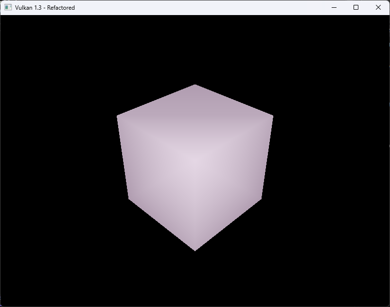

# Vulkan Lab 4: Lighting Fundamentals 


### EXERCISE 1:BASIC SCALING TRANSFORMATION
#### Goal: Update the application to support vertex normals and a new UBO for lighting data.

**Solution:**
I added normal vectors to each vertex so the GPU knows which direction each face is pointing. Lighting depends on these normals, so every 
face of the cube needs its own set of vertices, even if the positions are shared. This means the cube now uses 36 separate vertices instead
of reusing corners. I also updated the uniform buffer so I can send the light position and camera position to the shader each frame. Because
the vertices are no longer shared, I removed the index buffer and now draw the cube using only the vertex buffer. These changes give the 
shaders all the information they need to start calculating lighting on the cube.

- Vertex Structure Update:
```c++
struct Vertex {
    glm::vec3 pos;
    glm::vec3 color;
	glm::vec3 normal;      // <- Add normal vector

```
- Uniform Buffer Object Update:
```c++
struct UniformBufferObject {
    alignas(16) glm::mat4 model;
    alignas(16) glm::mat4 view;
    alignas(16) glm::mat4 proj;
	alignas(16) glm::vec3 lightPos;     // <- New light position
	alignas(16) glm::vec3 eyePos;       // <- New eye position
};
```
- Cube Vertex Data Update:
```c++
std::vector<Vertex> cubeVertices = {
    // Front (+Z) 
    {{-0.5f, -0.5f,  0.5f}, {1,0,0}, {0,0, 1}},
    {{ 0.5f, -0.5f,  0.5f}, {1,0,0}, {0,0, 1}},
    {{ 0.5f,  0.5f,  0.5f}, {1,0,0}, {0,0, 1}},
    {{ 0.5f,  0.5f,  0.5f}, {1,0,0}, {0,0, 1}},
    {{-0.5f,  0.5f,  0.5f}, {1,0,0}, {0,0, 1}},
    {{-0.5f, -0.5f,  0.5f}, {1,0,0}, {0,0, 1}},

    // Back (-Z)
    {{ 0.5f, -0.5f, -0.5f}, {0,1,0}, {0,0,-1}},
    {{-0.5f, -0.5f, -0.5f}, {0,1,0}, {0,0,-1}},
    {{-0.5f,  0.5f, -0.5f}, {0,1,0}, {0,0,-1}},
    {{-0.5f,  0.5f, -0.5f}, {0,1,0}, {0,0,-1}},
    {{ 0.5f,  0.5f, -0.5f}, {0,1,0}, {0,0,-1}},
    {{ 0.5f, -0.5f, -0.5f}, {0,1,0}, {0,0,-1}},

    // Left (-X) 
    {{-0.5f, -0.5f, -0.5f}, {0,0,1}, {-1,0,0}},
    {{-0.5f, -0.5f,  0.5f}, {0,0,1}, {-1,0,0}},
    {{-0.5f,  0.5f,  0.5f}, {0,0,1}, {-1,0,0}},
    {{-0.5f,  0.5f,  0.5f}, {0,0,1}, {-1,0,0}},
    {{-0.5f,  0.5f, -0.5f}, {0,0,1}, {-1,0,0}},
    {{-0.5f, -0.5f, -0.5f}, {0,0,1}, {-1,0,0}},

    // Right (+X) 
    {{ 0.5f, -0.5f,  0.5f}, {1,1,0}, {1,0,0}},
    {{ 0.5f, -0.5f, -0.5f}, {1,1,0}, {1,0,0}},
    {{ 0.5f,  0.5f, -0.5f}, {1,1,0}, {1,0,0}},
    {{ 0.5f,  0.5f, -0.5f}, {1,1,0}, {1,0,0}},
    {{ 0.5f,  0.5f,  0.5f}, {1,1,0}, {1,0,0}},
    {{ 0.5f, -0.5f,  0.5f}, {1,1,0}, {1,0,0}},

    // Top (+Y)
    {{-0.5f,  0.5f,  0.5f}, {1,0,1}, {0,1,0}},
    {{ 0.5f,  0.5f,  0.5f}, {1,0,1}, {0,1,0}},
    {{ 0.5f,  0.5f, -0.5f}, {1,0,1}, {0,1,0}},
    {{ 0.5f,  0.5f, -0.5f}, {1,0,1}, {0,1,0}},
    {{-0.5f,  0.5f, -0.5f}, {1,0,1}, {0,1,0}},
    {{-0.5f,  0.5f,  0.5f}, {1,0,1}, {0,1,0}},

    // Bottom (-Y) 
    {{-0.5f, -0.5f, -0.5f}, {0,1,1}, {0,-1,0}},
    {{ 0.5f, -0.5f, -0.5f}, {0,1,1}, {0,-1,0}},
    {{ 0.5f, -0.5f,  0.5f}, {0,1,1}, {0,-1,0}},
    {{ 0.5f, -0.5f,  0.5f}, {0,1,1}, {0,-1,0}},
    {{-0.5f, -0.5f,  0.5f}, {0,1,1}, {0,-1,0}},
    {{-0.5f, -0.5f, -0.5f}, {0,1,1}, {0,-1,0}},
};
```

-  Drawing without indices:
```c++
vkCmdDraw(commandBuffer, static_cast<uint32_t>(vertices.size()), 1, 0, 0);
```
```c++
void HelloTriangleApplication::updateUniformBuffer(uint32_t currentImage) {
    static auto startTime = std::chrono::high_resolution_clock::now();
    auto currentTime = std::chrono::high_resolution_clock::now();
    float time = std::chrono::duration<float>(currentTime - startTime).count();

    UniformBufferObject ubo{};
    ubo.model = glm::rotate(glm::mat4(1.0f), glm::radians(90.0f), glm::vec3(0.0f, 0.0f, 1.0f));
    ubo.view = glm::lookAt(glm::vec3(2.0f, 2.0f, 2.0f), glm::vec3(0.0f, 0.0f, 0.0f), glm::vec3(0.0f, 0.0f, 1.0f));
    ubo.proj = glm::perspective(glm::radians(45.0f), swapChainExtent.width / (float)swapChainExtent.height, 0.1f, 10.0f);
    ubo.proj[1][1] *= -1;

	ubo.lightPos = glm::vec3(1.0f, 1.0f, 1.0f); // <- New light position
	ubo.eyePos = glm::vec3(2.0f, 2.0f, 2.0f); // <- New eye position

    memcpy(uniformBuffersMapped[currentImage], &ubo, sizeof(ubo));
}
```
- Vertex Shader Update:
```c++
layout(binding = 0) uniform UniformBufferObject {
    mat4 model;
    mat4 view;
    mat4 proj;
    vec3 lightPos;
    vec3 eyePos;
} ubo;

layout(location=0) in vec3 inPosition;
layout(location=1) in vec3 inColor;
layout(location=2) in vec3 inNormal;

layout(location=0) out vec3 fragColor;
layout(location=1) out vec3 fragWorldPos;
layout(location=2) out vec3 fragWorldNormal;

void main() {
    vec4 worldPosition = ubo.model * vec4(inPosition, 1.0);
    fragWorldPos = worldPosition.xyz;
    mat3 normalMatrix = transpose(inverse(mat3(ubo.model)));
    fragWorldNormal = normalize(normalMatrix * inNormal);
    fragColor = inColor;
    gl_Position = ubo.proj * ubo.view * worldPosition;
}

```

**Output:**


**Reflection:**
This exercise helped me understand that lighting does not work properly unless the geometry data is set up correctly first. I saw how 
important normals are for shading because they tell the GPU how light should hit the surface. I also learned how a uniform buffer is used 
to pass important information like the light and camera position from the CPU to the GPU. This made me more aware that real-time rendering 
depends on good data flow between the application and the shaders. 

---

### EXERCISE 2: PER-VERTEX DIFFUSE LIGHTING
#### Goal: Implement a basic ambient and diffuse lighting model directly in the vertex shader.

**Solution:**
To implement per-vertex ambient and diffuse lighting, I used the normals and lighting data introduced in Exercise 1 and moved the lighting 
calculations into the vertex shader. The lab-provided code snippet was incomplete because it did not include the required gl_Position 
assignment and incorrectly multiplied the light color twice in the diffuse term. I corrected these issues by computing world-space position,
applying the proper inverse-transpose operation to transform normals, calculating ambient and diffuse lighting once, and then writing the 
final lit color to the fragColor output. The fragment shader remains a simple pass-through. Since the cube already uses 36 vertices with 
per-face normals, no changes to the C++ pipeline were required for this exercise. The result meets the goal of Exercise 2: to perform 
lighting at the vertex stage and observe the faceted shading effect.
```c++
#version 450

layout(binding = 0) uniform UniformBufferObject {
    mat4 model;
    mat4 view;
    mat4 proj;
    vec3 lightPos;
    vec3 eyePos; // kept for later exercises
} ubo;

layout(location = 0) in vec3 inPosition;
layout(location = 1) in vec3 inColor;   // not used in the calc here
layout(location = 2) in vec3 inNormal;

layout(location = 0) out vec3 fragColor;

void main() {
    // World-space transforms
    vec3 worldPos    = (ubo.model * vec4(inPosition, 1.0)).xyz;
    vec3 worldNormal = mat3(transpose(inverse(ubo.model))) * inNormal;
    vec3 norm        = normalize(worldNormal);

    // Light and material
    vec3 lightColor      = vec3(1.0, 1.0, 1.0);
    vec3 ambientMaterial = vec3(0.2, 0.1, 0.2);
    vec3 diffMaterial    = vec3(1.0, 1.0, 1.0);

    // Diffuse
    vec3 lightDir = normalize(ubo.lightPos - worldPos);
    float diff    = max(dot(norm, lightDir), 0.0);
    vec3 diffuse  = diff * lightColor;

    // Final per-vertex color: ambient + diffuse
    fragColor = ambientMaterial * lightColor + diffMaterial * diffuse;

    // Position
    gl_Position = ubo.proj * ubo.view * vec4(worldPos, 1.0);
}
```

**Output:**


**Reflection:**
This step showed me that lighting quality depends not only on shader formulas but also on correct spaces and data flow. Using the 
inverse-transpose for normals avoided skewed lighting when the model rotates, and performing the lighting in the vertex stage produced the 
expected faceted look because colors are interpolated across triangles. I also saw why we kept the richer UBO from Exercise 1: it already 
carries the transforms and light parameters needed here. With this foundation in place, I’m ready to move the lighting math to the fragment 
stage in the next exercise for smoother results.

---
### EXERCISE 3: PER-FRAGMENTDIFFUSE LIGHTING
#### Goal: Improve visual quality by moving the lighting logic to the fragment shader, allowing for smoother, more accurate calculations.

**Solution:**

```c++
```
```c++
```
```c++
```

**Output:**


**Reflection:**


--- 
### EXERCISE 4:ADDING PER-VERTEX SPECULAR LIGHTING
#### Goal: : Complete the reflection model implemented in Exercise 2 by adding specular highlights to the vertex shader.


**Solution:**

```c++
```
```c++
```
```c++
```

**Output:**


**Reflection:**


### EXERCISE 5:ADDING PER-FRAGMENT SPECULAR LIGHTING
#### Goal: Complete the reflection model implemented in Exercise 3 by adding specular highlights to the fragment shader.

**Solution:**

```c++
```
```c++
```
```c++
```

**Output:**

**Reflection:**

### EXERCISE 6: MULTIPLE LIGHTS AND MATERIALS

**Solution:**

```c++
```
```c++
```
```c++
```

**Output:**

**Reflection:**


### FURTHER EXPLORATION 

**Solution:**


***Reflection:***
