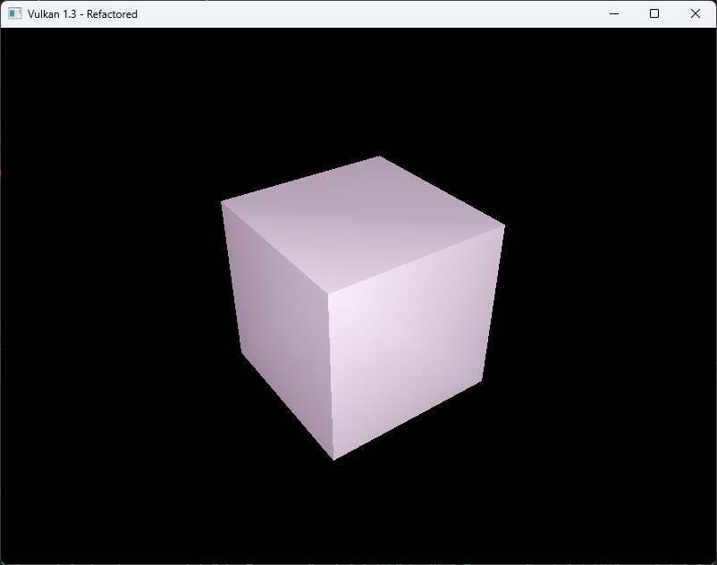

# Vulkan Lab 4: Lighting Fundamentals 


### EXERCISE 1:BASIC SCALING TRANSFORMATION
#### Goal: Update the application to support vertex normals and a new UBO for lighting data.

**Solution:**
I added normal vectors to each vertex so the GPU knows which direction each face is pointing. Lighting depends on these normals, so every 
face of the cube needs its own set of vertices, even if the positions are shared. This means the cube now uses 36 separate vertices instead
of reusing corners. I also updated the uniform buffer so I can send the light position and camera position to the shader each frame. Because
the vertices are no longer shared, I removed the index buffer and now draw the cube using only the vertex buffer. These changes give the 
shaders all the information they need to start calculating lighting on the cube.

- Vertex Structure Update:
```c++
struct Vertex {
    glm::vec3 pos;
    glm::vec3 color;
	glm::vec3 normal;      // <- Add normal vector

```
- Uniform Buffer Object Update:
```c++
struct UniformBufferObject {
    alignas(16) glm::mat4 model;
    alignas(16) glm::mat4 view;
    alignas(16) glm::mat4 proj;
	alignas(16) glm::vec3 lightPos;     // <- New light position
	alignas(16) glm::vec3 eyePos;       // <- New eye position
};
```
- Cube Vertex Data Update:
```c++
std::vector<Vertex> cubeVertices = {
    // Front (+Z) 
    {{-0.5f, -0.5f,  0.5f}, {1,0,0}, {0,0, 1}},
    {{ 0.5f, -0.5f,  0.5f}, {1,0,0}, {0,0, 1}},
    {{ 0.5f,  0.5f,  0.5f}, {1,0,0}, {0,0, 1}},
    {{ 0.5f,  0.5f,  0.5f}, {1,0,0}, {0,0, 1}},
    {{-0.5f,  0.5f,  0.5f}, {1,0,0}, {0,0, 1}},
    {{-0.5f, -0.5f,  0.5f}, {1,0,0}, {0,0, 1}},

    // Back (-Z)
    {{ 0.5f, -0.5f, -0.5f}, {0,1,0}, {0,0,-1}},
    {{-0.5f, -0.5f, -0.5f}, {0,1,0}, {0,0,-1}},
    {{-0.5f,  0.5f, -0.5f}, {0,1,0}, {0,0,-1}},
    {{-0.5f,  0.5f, -0.5f}, {0,1,0}, {0,0,-1}},
    {{ 0.5f,  0.5f, -0.5f}, {0,1,0}, {0,0,-1}},
    {{ 0.5f, -0.5f, -0.5f}, {0,1,0}, {0,0,-1}},

    // Left (-X) 
    {{-0.5f, -0.5f, -0.5f}, {0,0,1}, {-1,0,0}},
    {{-0.5f, -0.5f,  0.5f}, {0,0,1}, {-1,0,0}},
    {{-0.5f,  0.5f,  0.5f}, {0,0,1}, {-1,0,0}},
    {{-0.5f,  0.5f,  0.5f}, {0,0,1}, {-1,0,0}},
    {{-0.5f,  0.5f, -0.5f}, {0,0,1}, {-1,0,0}},
    {{-0.5f, -0.5f, -0.5f}, {0,0,1}, {-1,0,0}},

    // Right (+X) 
    {{ 0.5f, -0.5f,  0.5f}, {1,1,0}, {1,0,0}},
    {{ 0.5f, -0.5f, -0.5f}, {1,1,0}, {1,0,0}},
    {{ 0.5f,  0.5f, -0.5f}, {1,1,0}, {1,0,0}},
    {{ 0.5f,  0.5f, -0.5f}, {1,1,0}, {1,0,0}},
    {{ 0.5f,  0.5f,  0.5f}, {1,1,0}, {1,0,0}},
    {{ 0.5f, -0.5f,  0.5f}, {1,1,0}, {1,0,0}},

    // Top (+Y)
    {{-0.5f,  0.5f,  0.5f}, {1,0,1}, {0,1,0}},
    {{ 0.5f,  0.5f,  0.5f}, {1,0,1}, {0,1,0}},
    {{ 0.5f,  0.5f, -0.5f}, {1,0,1}, {0,1,0}},
    {{ 0.5f,  0.5f, -0.5f}, {1,0,1}, {0,1,0}},
    {{-0.5f,  0.5f, -0.5f}, {1,0,1}, {0,1,0}},
    {{-0.5f,  0.5f,  0.5f}, {1,0,1}, {0,1,0}},

    // Bottom (-Y) 
    {{-0.5f, -0.5f, -0.5f}, {0,1,1}, {0,-1,0}},
    {{ 0.5f, -0.5f, -0.5f}, {0,1,1}, {0,-1,0}},
    {{ 0.5f, -0.5f,  0.5f}, {0,1,1}, {0,-1,0}},
    {{ 0.5f, -0.5f,  0.5f}, {0,1,1}, {0,-1,0}},
    {{-0.5f, -0.5f,  0.5f}, {0,1,1}, {0,-1,0}},
    {{-0.5f, -0.5f, -0.5f}, {0,1,1}, {0,-1,0}},
};
```

-  Drawing without indices:
```c++
vkCmdDraw(commandBuffer, static_cast<uint32_t>(vertices.size()), 1, 0, 0);
```
```c++
void HelloTriangleApplication::updateUniformBuffer(uint32_t currentImage) {
    static auto startTime = std::chrono::high_resolution_clock::now();
    auto currentTime = std::chrono::high_resolution_clock::now();
    float time = std::chrono::duration<float>(currentTime - startTime).count();

    UniformBufferObject ubo{};
    ubo.model = glm::rotate(glm::mat4(1.0f), glm::radians(90.0f), glm::vec3(0.0f, 0.0f, 1.0f));
    ubo.view = glm::lookAt(glm::vec3(2.0f, 2.0f, 2.0f), glm::vec3(0.0f, 0.0f, 0.0f), glm::vec3(0.0f, 0.0f, 1.0f));
    ubo.proj = glm::perspective(glm::radians(45.0f), swapChainExtent.width / (float)swapChainExtent.height, 0.1f, 10.0f);
    ubo.proj[1][1] *= -1;

	ubo.lightPos = glm::vec3(1.0f, 1.0f, 1.0f); // <- New light position
	ubo.eyePos = glm::vec3(2.0f, 2.0f, 2.0f); // <- New eye position

    memcpy(uniformBuffersMapped[currentImage], &ubo, sizeof(ubo));
}
```
- Vertex Shader Update:
```c++
layout(binding = 0) uniform UniformBufferObject {
    mat4 model;
    mat4 view;
    mat4 proj;
    vec3 lightPos;
    vec3 eyePos;
} ubo;

layout(location=0) in vec3 inPosition;
layout(location=1) in vec3 inColor;
layout(location=2) in vec3 inNormal;

layout(location=0) out vec3 fragColor;
layout(location=1) out vec3 fragWorldPos;
layout(location=2) out vec3 fragWorldNormal;

void main() {
    vec4 worldPosition = ubo.model * vec4(inPosition, 1.0);
    fragWorldPos = worldPosition.xyz;
    mat3 normalMatrix = transpose(inverse(mat3(ubo.model)));
    fragWorldNormal = normalize(normalMatrix * inNormal);
    fragColor = inColor;
    gl_Position = ubo.proj * ubo.view * worldPosition;
}

```

**Output:**


**Reflection:**
This exercise helped me understand that lighting does not work properly unless the geometry data is set up correctly first. I saw how 
important normals are for shading because they tell the GPU how light should hit the surface. I also learned how a uniform buffer is used 
to pass important information like the light and camera position from the CPU to the GPU. This made me more aware that real-time rendering 
depends on good data flow between the application and the shaders. 

---

### EXERCISE 2: PER-VERTEX DIFFUSE LIGHTING
#### Goal: Implement a basic ambient and diffuse lighting model directly in the vertex shader.

**Solution:**
To implement per-vertex ambient and diffuse lighting, I used the normals and lighting data introduced in Exercise 1 and moved the lighting 
calculations into the vertex shader. The lab-provided code snippet was incomplete because it did not include the required gl_Position 
assignment and incorrectly multiplied the light color twice in the diffuse term. I corrected these issues by computing world-space position,
applying the proper inverse-transpose operation to transform normals, calculating ambient and diffuse lighting once, and then writing the 
final lit color to the fragColor output. The fragment shader remains a simple pass-through. Since the cube already uses 36 vertices with 
per-face normals, no changes to the C++ pipeline were required for this exercise. The result meets the goal of Exercise 2: to perform 
lighting at the vertex stage and observe the faceted shading effect.

- Pipeline Shader Stage Update:
```c++
uboLayoutBinding.stageFlags = VK_SHADER_STAGE_VERTEX_BIT;
```
- Drawing Command (no change from Exercise 1):
```c++
vkCmdDraw(commandBuffer, static_cast<uint16_t>(vertices.size()), 1, 0, 0);
```
```c++
#version 450

layout(binding = 0) uniform UniformBufferObject {
    mat4 model;
    mat4 view;
    mat4 proj;
    vec3 lightPos;
    vec3 eyePos; 
} ubo;

layout(location = 0) in vec3 inPosition;
layout(location = 1) in vec3 inColor;   
layout(location = 2) in vec3 inNormal;

layout(location = 0) out vec3 fragColor;

void main() {
    // World-space transforms
    vec3 worldPos    = (ubo.model * vec4(inPosition, 1.0)).xyz;
    vec3 worldNormal = mat3(transpose(inverse(ubo.model))) * inNormal;
    vec3 norm        = normalize(worldNormal);

    // Light and material
    vec3 lightColor      = vec3(1.0, 1.0, 1.0);
    vec3 ambientMaterial = vec3(0.2, 0.1, 0.2);
    vec3 diffMaterial    = vec3(1.0, 1.0, 1.0);

    // Diffuse
    vec3 lightDir = normalize(ubo.lightPos - worldPos);
    float diff    = max(dot(norm, lightDir), 0.0);
    vec3 diffuse  = diff * lightColor;

    // Final per-vertex color: ambient + diffuse
    fragColor = ambientMaterial * lightColor + diffMaterial * diffuse;

    // Position
    gl_Position = ubo.proj * ubo.view * vec4(worldPos, 1.0);
}
```

**Output:**


**Reflection:**
This step showed me that lighting quality depends not only on shader formulas but also on correct spaces and data flow. Using the 
inverse-transpose for normals avoided skewed lighting when the model rotates, and performing the lighting in the vertex stage produced the 
expected faceted look because colors are interpolated across triangles. I also saw why we kept the richer UBO from Exercise 1: it already 
carries the transforms and light parameters needed here. With this foundation in place, I’m ready to move the lighting math to the fragment 
stage in the next exercise for smoother results.

---
### EXERCISE 3: PER-FRAGMENTDIFFUSE LIGHTING
#### Goal: Improve visual quality by moving the lighting logic to the fragment shader, allowing for smoother, more accurate calculations.

**Solution:**
I completed per fragment diffuse lighting by shifting the lighting calculations from the vertex 
shader to the fragment shader. The vertex shader now transforms each vertex to world space, 
computes a world space normal using the inverse transpose of the model matrix, and passes only 
world position and world normal to the fragment stage. I updated the descriptor set layout so the 
uniform buffer can be read in the fragment stage. I also exposed the normal attribute in the vertex 
input descriptions and removed the unused index buffer bind since the draw is non indexed. The 
fragment shader reads the interpolated world position and world normal, builds a unit light 
direction from the uniform light position, and evaluates ambient plus diffuse to produce the final 
color per pixel, with no tint from vertex colors. The result is a cube rendered with a single base 
hue whose faces vary only by brightness according to the light direction.

- Vertex Shader:
```c++
#version 450

layout(binding = 0) uniform UniformBufferObject {
    mat4 model;
    mat4 view;
    mat4 proj;
    vec3 lightPos;
    vec3 eyePos; // kept for later work
} ubo;

layout(location = 0) in vec3 inPosition;
layout(location = 1) in vec3 inColor;   // not used for lighting here
layout(location = 2) in vec3 inNormal;

layout(location = 0) out vec3 fragWorldPos;
layout(location = 1) out vec3 fragWorldNormal;

void main() {
    vec4 worldPosition = ubo.model * vec4(inPosition, 1.0);
    fragWorldPos = worldPosition.xyz;

    mat3 normalMatrix = transpose(inverse(mat3(ubo.model)));
    fragWorldNormal = normalize(normalMatrix * inNormal);

    gl_Position = ubo.proj * ubo.view * worldPosition;
}
```
- Fragment Shader:
```c++
#version 450

layout(binding = 0) uniform UniformBufferObject {
    mat4 model;
    mat4 view;
    mat4 proj;
    vec3 lightPos;
    vec3 eyePos;
} ubo;

layout(location = 0) in vec3 fragWorldPos;
layout(location = 1) in vec3 fragWorldNormal;

layout(location = 0) out vec4 outColor;

void main() {
    vec3 lightColor      = vec3(1.0);
    vec3 ambientMaterial = vec3(0.2, 0.1, 0.2);
    vec3 diffMaterial    = vec3(1.0);

    vec3 n = normalize(fragWorldNormal);
    vec3 l = normalize(ubo.lightPos - fragWorldPos);

    float diff   = max(dot(n, l), 0.0);
    vec3 diffuse = diff * lightColor;

    vec3 color = ambientMaterial * lightColor + diffMaterial * diffuse;
    outColor = vec4(color, 1.0);
}
```
```c++
static std::array<VkVertexInputAttributeDescription, 3> getAttributeDescriptions() {
    std::array<VkVertexInputAttributeDescription, 3> attributeDescriptions{};
    attributeDescriptions[0] = { 0, 0, VK_FORMAT_R32G32B32_SFLOAT, offsetof(Vertex, pos)    };
    attributeDescriptions[1] = { 1, 0, VK_FORMAT_R32G32B32_SFLOAT, offsetof(Vertex, color)  };
    attributeDescriptions[2] = { 2, 0, VK_FORMAT_R32G32B32_SFLOAT, offsetof(Vertex, normal) };
    return attributeDescriptions;
}
```
```c++
uboLayoutBinding.stageFlags = VK_SHADER_STAGE_VERTEX_BIT | VK_SHADER_STAGE_FRAGMENT_BIT;
```
**Output:**

- 70 degrees view:


- 80 degrees view:


**Reflection:**
This exercise made the benefit of pixel shading very clear. In the previous exercise the lighting 
was calculated per vertex and then interpolated, which produced a faceted and slightly flat 
appearance across the cube’s faces. After moving the lighting to the fragment shader, the normals 
and positions are interpolated first and the lighting is evaluated at every pixel, which produces 
smoother shading and a more natural falloff of light across surfaces. I also reinforced two 
practical Vulkan details that matter for correctness and debugging. First, stage visibility must 
include the fragment stage when a shader reads the uniform buffer there. Second, the pipeline must
advertise every vertex attribute actually used by the shaders, including normals, and state should 
not bind resources that are not used, such as an index buffer when drawing non indexed geometry.


--- 
### EXERCISE 4:ADDING PER-VERTEX SPECULAR LIGHTING
#### Goal: : Complete the reflection model implemented in Exercise 2 by adding specular highlights to the vertex shader.


**Solution:**
In this exercise I completed the Phong reflection model by adding a specular component to the vertex shader. This extended the lighting calculations from Exercise 2, 
where only ambient and diffuse were used. I transformed the vertex position and normal to world space, calculated the light direction and diffuse term, then computed 
the view direction using the eye position from the uniform buffer. I generated the reflection vector using the GLSL reflect function and applied the shininess exponent 
so the highlight intensity falls off correctly. The final lighting result is the sum of ambient, diffuse, and specular components and it is written to fragColor. 
The fragment shader remained unchanged, simply outputting the interpolated vertex colour. This correctly implements per vertex specular lighting as defined in the 
exercise requirements.

```c++
#version 450

layout(binding = 0) uniform UniformBufferObject {
    mat4 model;
    mat4 view;
    mat4 proj;
    vec3 lightPos;
    vec3 eyePos;
} ubo;

layout(location=0) in vec3 inPosition;
layout(location=1) in vec3 inColor;
layout(location=2) in vec3 inNormal;

layout(location=0) out vec3 fragColor;

void main() {
    // Transform to world space
    vec3 worldPos = (ubo.model * vec4(inPosition, 1.0)).xyz;
    vec3 worldNormal = mat3(transpose(inverse(ubo.model))) * inNormal;
    vec3 norm = normalize(worldNormal);

    vec3 lightColor = vec3(1.0);
    vec3 ambientMaterial = vec3(0.2, 0.1, 0.2);
    vec3 diffMaterial = vec3(1.0);

    // Diffuse
    vec3 lightDir = normalize(ubo.lightPos - worldPos);
    float diff = max(dot(norm, lightDir), 0.0);
    vec3 diffuse = diff * lightColor;

    // Specular
    vec3 viewDir = normalize(ubo.eyePos - worldPos);
    vec3 reflectDir = normalize(reflect(-lightDir, norm));
    float shininess = 32.0;
    float spec = pow(max(dot(reflectDir, viewDir), 0.0), shininess);
    vec3 specMaterial = vec3(1.0);
    vec3 specular = specMaterial * lightColor * spec;

    // Output lighting result (per-vertex)
    fragColor = ambientMaterial * lightColor + diffMaterial * diffuse + specular;

    gl_Position = ubo.proj * ubo.view * vec4(worldPos, 1.0);
}

```

**Output:**

- 70 degrees view:


- 80 degrees view:


**Reflection:**
Initially, I could not see the difference between Exercise 3 and Exercise 4, because the specular term was subtle and was being overshadowed by the diffuse lighting. 
To understand why, I experimented with different light positions, material strengths, and shininess values. Reducing the ambient intensity and increasing 
the specular material strength made the highlight more visible, while adjusting the light direction ensured that at least one face of the cube reflected light 
toward the camera. This confirmed that the specular calculation was working correctly but showed how sensitive highlights are to lighting conditions. I also learned 
that per vertex specular can appear softer or slightly inaccurate because it is interpolated across the triangle surface, but the highlight does move across the 
cube and responds properly to rotation. These experiments helped me clearly see how the addition of specular lighting enhances realism compared to Exercise 2 and Exercise 3.


### EXERCISE 5:ADDING PER-FRAGMENT SPECULAR LIGHTING
#### Goal: Complete the reflection model implemented in Exercise 3 by adding specular highlights to the fragment shader.

**Solution:**
In this exercise I completed the lighting model by moving the specular component from the vertex shader into the fragment shader so the ambient diffuse and specular lighting are
now calculated for every pixel. The vertex shader simply transforms each vertex to world space and passes the world position and world normal into the fragment shader. The 
fragment shader uses these interpolated values to compute the Phong reflection model with the light direction view direction and reflection vector all evaluated per fragment. 
This produces a more accurate result because the specular effect no longer depends on vertex interpolation. By updating the shader responsibilities in this way the lighting now 
responds smoothly and correctly across the entire surface which successfully completes the requirements of the exercise.

```c++
#version 450

layout(binding = 0) uniform UniformBufferObject {
    mat4 model;
    mat4 view;
    mat4 proj;
    vec3 lightPos;
    vec3 eyePos;
} ubo;

layout(location = 0) in vec3 fragWorldPos;
layout(location = 1) in vec3 fragWorldNormal;

layout(location = 0) out vec4 outColor;

void main() {
    vec3 lightColor      = vec3(1.0);
    vec3 ambientMaterial = vec3(0.2, 0.1, 0.2);
    vec3 diffMaterial    = vec3(1.0);
    vec3 specMaterial    = vec3(1.0);

    float shininess = 32.0;

    vec3 N = normalize(fragWorldNormal);
    vec3 L = normalize(ubo.lightPos - fragWorldPos);
    vec3 V = normalize(ubo.eyePos - fragWorldPos);
    vec3 R = reflect(-L, N);

    float diff = max(dot(N, L), 0.0);
    vec3 diffuse = diff * lightColor;

    float spec = pow(max(dot(R, V), 0.0), shininess);
    vec3 specular = specMaterial * lightColor * spec;

    vec3 color = ambientMaterial * lightColor
               + diffMaterial * diffuse
               + specular;

    outColor = vec4(color, 1.0);
}
```


**Output:**

- 70 degrees view:


- 80 degrees view:


- **Reflection:**
Moving the specular calculation into the fragment shader resulted in a clear visual improvement. In the previous exercise the highlight appeared soft and sometimes stretched 
because it was being interpolated across the triangles. After making the change the highlight became sharper and more realistic because it was calculated independently for 
each pixel. I experimented with different shininess values and light and camera positions to see how the highlight changed based on surface orientation and viewing angle. 
Through these tests I gained a better understanding of why per fragment lighting is preferred when trying to achieve higher visual quality in real time rendering and how 
each part of the Phong model contributes to the final appearance.

### EXERCISE 6: MULTIPLE LIGHTS AND MATERIALS

**Solution:**

```c++
```
```c++
```
```c++
```

**Output:**

**Reflection:**


### FURTHER EXPLORATION 

**Solution:**


***Reflection:***
