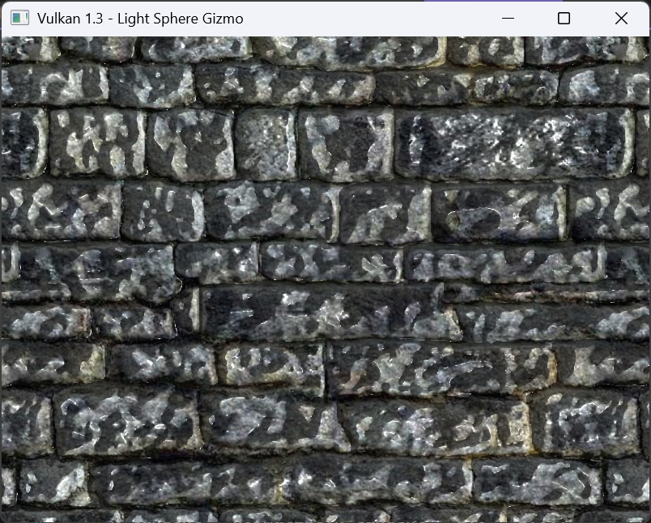
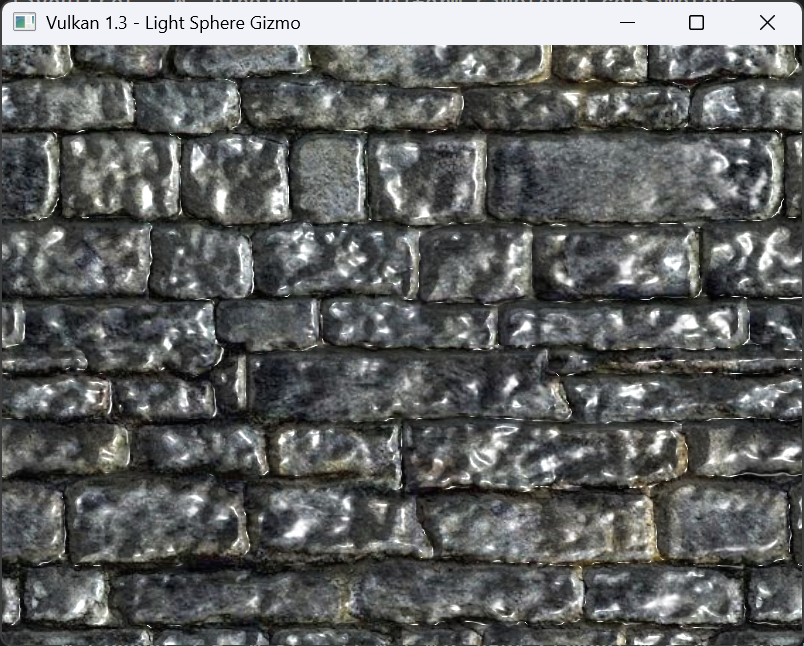
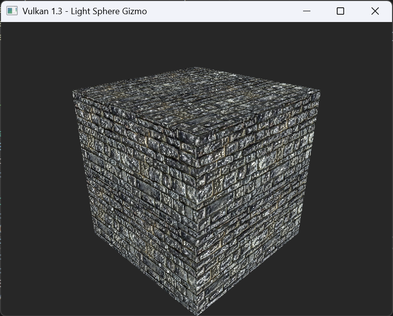
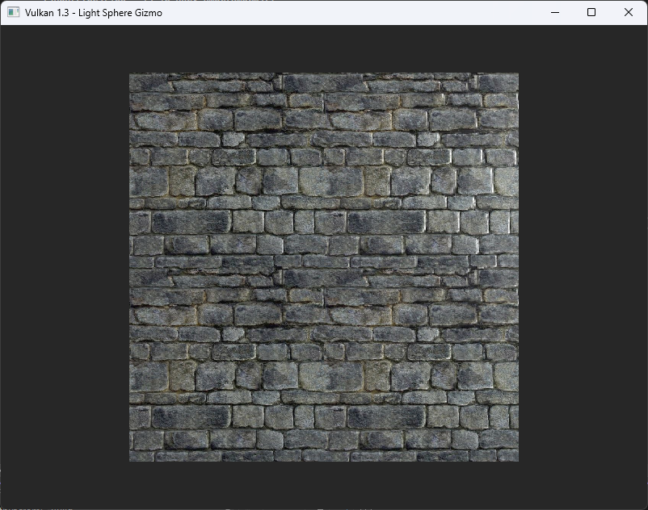
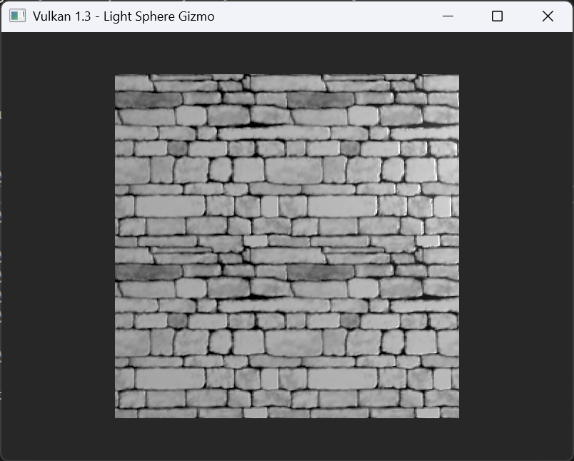
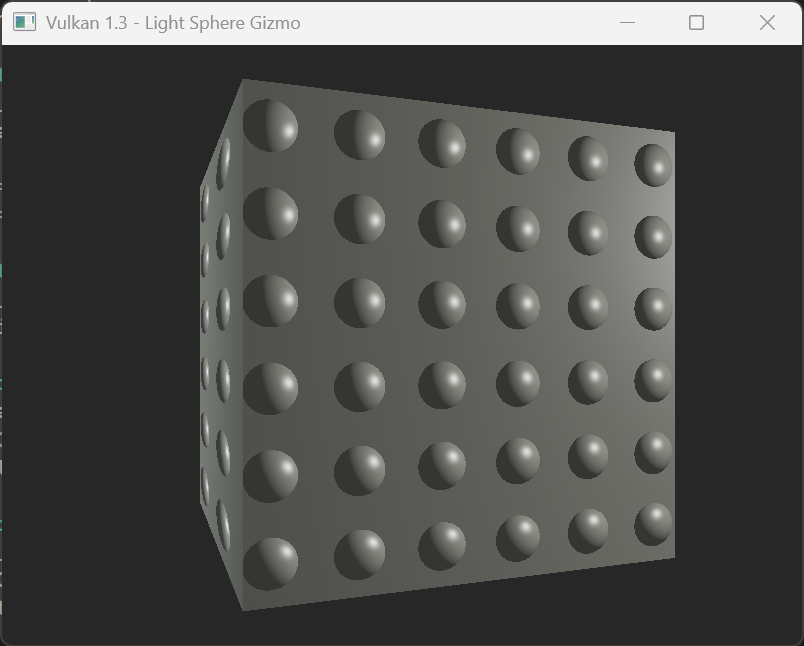

# Vulkan Lab 6: Bump Mapping


### EXERCISE 1:  PREPARING FOR TANGENT SPACE

**Solution:**
In this exercise, I extended the rendering setup so that every vertex now carries a full tangent basis, which is required 
for later normal mapping. I updated the C++ Vertex struct to include two extra vectors, tangent and binormal, alongside 
the existing position, colour, normal, and texture coordinate fields. I then adjusted the vertex input description to
expose these two new attributes to the Vulkan pipeline with the correct locations and byte offsets so the GPU reads them 
in the same order they are laid out in memory.

After that, I modified the cube’s vertex data to supply values for the tangent and binormal for each vertex on every face.
For example, on the front face, which points along the positive Z axis, the tangent vector points along +X and the 
binormal along +Y. On the back face, which faces −Z, the tangent points −X and the binormal +Y. This pattern continues 
consistently across the six faces of the cube. With these vectors defined, each vertex now carries a complete TBN 
(Tangent, Binormal, Normal) frame that defines how texture-space directions map to world-space directions. This setup 
ensures that in later stages, the fragment shader can correctly interpret normals sampled from a normal map and transform 
them properly in tangent space.

- Define a Vertex structure that includes position, color, normal, UV coordinates, tangent, and binormal vectors.
```c++
struct Vertex {
    glm::vec3 pos;
    glm::vec3 color;
    glm::vec3 normal;
    glm::vec2 uv;
    glm::vec3 tangent;
    glm::vec3 binormal;

    static VkVertexInputBindingDescription getBindingDescription() {
        VkVertexInputBindingDescription b{};
        b.binding = 0;
        b.stride = sizeof(Vertex);
        b.inputRate = VK_VERTEX_INPUT_RATE_VERTEX;
        return b;
    }

    static std::array<VkVertexInputAttributeDescription, 6> getAttributeDescriptions() {
        std::array<VkVertexInputAttributeDescription, 6> a{};

        a[0] = { 0, 0, VK_FORMAT_R32G32B32_SFLOAT, offsetof(Vertex, pos) };
        a[1] = { 1, 0, VK_FORMAT_R32G32B32_SFLOAT, offsetof(Vertex, color) };
        a[2] = { 2, 0, VK_FORMAT_R32G32B32_SFLOAT, offsetof(Vertex, normal) };
        a[3] = { 3, 0, VK_FORMAT_R32G32_SFLOAT,    offsetof(Vertex, uv) };
        a[4] = { 4, 0, VK_FORMAT_R32G32B32_SFLOAT, offsetof(Vertex, tangent) };
        a[5] = { 5, 0, VK_FORMAT_R32G32B32_SFLOAT, offsetof(Vertex, binormal) };

        return a;
    }
};
```

- Update the cube vertex data to include tangent and binormal vectors for each vertex.
```c++
std::vector<Vertex> cubeVertices = {
    // Front (+Z)
    {{-0.5f,-0.5f,  0.5f}, {1,0,0}, {0,0, 1}, faceUV(1.0f,{0,1}), {1,0,0}, {0,1,0}},
    {{ 0.5f,-0.5f,  0.5f}, {1,0,0}, {0,0, 1}, faceUV(1.0f,{1,1}), {1,0,0}, {0,1,0}},
    {{ 0.5f, 0.5f,  0.5f}, {1,0,0}, {0,0, 1}, faceUV(1.0f,{1,0}), {1,0,0}, {0,1,0}},
    {{ 0.5f, 0.5f,  0.5f}, {1,0,0}, {0,0, 1}, faceUV(1.0f,{1,0}), {1,0,0}, {0,1,0}},
    {{-0.5f, 0.5f,  0.5f}, {1,0,0}, {0,0, 1}, faceUV(1.0f,{0,0}), {1,0,0}, {0,1,0}},
    {{-0.5f,-0.5f,  0.5f}, {1,0,0}, {0,0, 1}, faceUV(1.0f,{0,1}), {1,0,0}, {0,1,0}},

    // ... other faces ...
```


**Reflection:**
Doing this step showed me why normal mapping is not just “plug in a texture.” The shader needs to know how the surface 
is oriented per vertex, and that orientation is described by tangent, binormal, and normal together. Vulkan’s explicit 
layout rules also became clearer here, because after changing the vertex struct I had to update the attribute 
descriptions to match it exactly, otherwise the GPU would read the wrong data. Defining tangents and binormals manually 
for each cube face also gave me a deeper understanding of how texture UVs align with local surface directions. It helped 
that the geometry was simple enough to reason about visually. Overall, this exercise completed the data-side foundation 
for tangent-space shading and set the stage for the next steps, sampling a normal map, lighting in tangent space, and 
experimenting with height or parallax mapping.

--------------------------------

### EXERCISE 2:  NORMAL MAPPING IMPLEMENTATION

**Solution:**

In this exercise I implemented tangent space normal mapping to improve surface detail. In the vertex shader I added 
tangent and binormal inputs and outputs for the tangent space transformations. I calculated a TBN matrix from the 
transformed tangent, binormal and normal vectors, and used it to convert the light, view and fragment positions into
tangent space before passing them to the fragment shader. In the fragment shader I added two samplers, one for the
colour texture and one for the normal map. The normal map was sampled and converted from [0,1] to [-1,1] space, then 
normalised. I modified the z component of the tangent space normal with N_tangent.z *= 0.8 to exaggerate the bump 
effect. Lighting was calculated entirely in tangent space using diffuse and specular components. In the C++ code I 
ensured the normal map used a linear UNORM format so that the texture data was read correctly. These updates completed
the normal mapping implementation and clearly demonstrated how tangent space normals alter surface appearance.

- Vertex Shader Modifications:
```c++
layout(location = 4) in vec3 inTangent;
layout(location = 5) in vec3 inBinormal;
```

- Transforming Light, View, and Fragment Positions to Tangent Space:
```c++
layout(location = 4) out vec3 fragLightPos_tangent;
layout(location = 5) out vec3 fragViewPos_tangent;
layout(location = 6) out vec3 fragPos_tangent;
```
- Calculating the TBN Matrix and Transforming Positions:
```c++
mat3 Nmat = mat3(transpose(inverse(ubo.model)));
vec3 T = normalize(Nmat * inTangent);
vec3 B = normalize(Nmat * inBinormal);
vec3 N = normalize(Nmat * inNormal);
mat3 TBN = transpose(mat3(T, B, N));

vec3 lightPos_world = ubo.lightPos;
vec3 viewPos_world  = ubo.viewPos;
vec3 fragPos_world  = vWorldPos;

fragLightPos_tangent = TBN * lightPos_world;
fragViewPos_tangent  = TBN * viewPos_world;
fragPos_tangent      = TBN * fragPos_world;
```

- Fragment Shader Modifications:
```c++
layout(set = 0, binding = 1) uniform sampler2D colSampler;
layout(set = 0, binding = 2) uniform sampler2D normalSampler;
```

- Receiving Transformed Positions:
```c++
layout(location = 4) in vec3 fragLightPos_tangent;
layout(location = 5) in vec3 fragViewPos_tangent;
layout(location = 6) in vec3 fragPos_tangent;
```

- Sampling the Normal Map and Performing Lighting Calculations:
```c++
vec3 albedo = texture(colSampler, vUV).rgb;
vec3 N_tangent = texture(normalSampler, vUV).rgb;
N_tangent = normalize(N_tangent * 2.0 - 1.0);

// exaggerate bump
N_tangent.z *= 0.8;  
N_tangent = normalize(N_tangent);

vec3 L = normalize(fragLightPos_tangent - fragPos_tangent);
vec3 V = normalize(fragViewPos_tangent  - fragPos_tangent);
vec3 H = normalize(L + V);

float diff = max(dot(N_tangent, L), 0.0);
float spec = pow(max(dot(N_tangent, H), 0.0), 32.0);
```

- Modifications to Load the Normal Map Texture:
```c++
void HelloTriangleApplication::createTextureImageView2() {
    textureImageView2 = createImageView(
    textureImage2,
    VK_FORMAT_R8G8B8A8_UNORM,
    VK_IMAGE_ASPECT_COLOR_BIT
    );
}
```

**Output:**

- Normal Mapping Effect:



- Enhanced Detail:



**Reflection:**
This exercise helped me understand how tangent space normal mapping works and why it is needed for realistic 
surface detail. Implementing the tangent and binormal vectors showed me how each vertex defines its own 
local surface orientation and how the TBN matrix allows world space data to be interpreted in tangent space. 
I learned that lighting in tangent space makes it possible to use normal maps from textures to simulate fine 
surface detail without increasing geometry complexity. Adjusting the z component of the tangent space normal 
made it clear how the perceived depth of bumps depends on the strength of the normal tilt. I also realised how 
important correct texture formats are, since using a linear UNORM format for the normal map ensures accurate 
lighting results. Overall this task strengthened my understanding of per-pixel lighting and the data flow 
between vertex and fragment shaders.

--------------------------------

### EXERCISE 3: HEIGHT MAP BUMPY EFFECT

**Solution:**

- Gray Scale Height Map:
```c++
float h = texture(heightSampler, vUV).r;
vec3 albedo = vec3(h);
```

- Fragment Shader Modifications:
```c++
vec3 albedo = texture(colSampler, vUV).rgb;
float h = texture(heightSampler, vUV).r;

float dhdx = dFdx(h);
float dhdy = dFdy(h);

float bumpStrength = 50.0;
vec3 bumpN = normalize(vec3(-dhdx * bumpStrength, -dhdy * bumpStrength, 1.0));

vec3 L = normalize(ubo.lightPos - vWorldPos);
vec3 V = normalize(ubo.eyePos  - vWorldPos);
vec3 H = normalize(L + V);

float diff = max(dot(bumpN, L), 0.0);
float spec = pow(max(dot(bumpN, H), 0.0), 32.0);

vec3 ambient  = 0.15 * albedo;
vec3 diffuse  = diff * albedo;
vec3 specular = spec * vec3(1.0);

vec3 result = ambient + diffuse + specular;
outColor = vec4(result, 1.0);
```

**Output:**
In this exercise I replaced the normal map with a height map and implemented bump mapping directly in the fragment shader. 
I sampled the height value from the texture using texture(heightSampler, vUV).r and calculated the screen space derivatives 
with dFdx and dFdy. I then constructed a perturbed normal using vec3 bumpN = normalize(vec3(-dhdx, -dhdy, bumpHeight)); and
applied the same lighting model as before. The light, view and half vectors were calculated in world space from the uniform 
buffer data and used to compute diffuse and specular lighting. On the C++ side I loaded rockHeight.tga into binding two as a 
combined image sampler and kept the same descriptor layout so that the fragment shader could sample the height map.

- Bumpier Surface:



- Flat Surface:



- Height Map:




**Reflection:**
This task showed how a height map can be used to generate bump effects without relying on precomputed normals. Adjusting the
bump height value changed how steep the surface appeared and demonstrated how sensitive the shading is to this parameter. A 
smaller bump height produced stronger visible bumps because the Z component of the normal was reduced, while a larger value
flattened the surface. This helped me understand the relationship between the gradient strength and the perceived surface 
depth and how simple derivative based perturbations can give a convincing sense of texture detail.

--------------------------------

### EXERCISE 4:  PROCEDURAL NORMAL MAPPING

**Solution:**
To complete the procedural normal mapping exercise, I generated a bumpy surface effect directly in the fragment shader 
using mathematical functions rather than a normal or height map. I defined a bumpNormal() function that creates 
dome-shaped normals within circular regions by mapping the current fragment’s coordinates with fract() and computing the
normal as N.xy = st / sqrt(r² - (x² + y²)). Instead of relying on the cube’s UVs, I used world-space coordinates 
(vWorldPos.xy) multiplied by a density value to ensure consistent tiling across all faces. The resulting normal was then
used in a standard Blinn–Phong lighting model to produce specular highlights and diffuse shading, while the surface 
colour came from a sampled texture. This combination of procedural normals and texturing produced a visually convincing
bumpy pattern across the cube’s surface without using any normal or height maps.

- Procedural Bump Normal Function:
```c++
const float BumpDensity = 6.0;   //
const float Radius      = 0.6;   // 

vec3 bumpNormal(vec2 xy)
{
    vec3 N = vec3(0.0, 0.0, 1.0);
    vec2 st = 2.0 * fract(xy) - 1.0; 

    float r2 = Radius * Radius;
    float d2 = dot(st, st);
    float R2 = r2 - d2;

    if (R2 > 0.0) {
        float z = sqrt(R2);
        N.xy = st / z;
    }
    return normalize(N);
}
```

- Fragment Shader Main Function:
```c++
void main()
{
    // procedural normal in world space
    vec2 p = vWorldPos.xy * BumpDensity;
    vec3 N = bumpNormal(p);

    // lighting setup
    vec3 L = normalize(ubo.lightPos - vWorldPos);
    vec3 V = normalize(ubo.eyePos  - vWorldPos);
    vec3 H = normalize(L + V);
    float NdotL = max(dot(N, L), 0.0);

    // texture for base color
    vec3 albedo = texture(colorTex, vUV).rgb;

    // Blinn–Phong lighting
    vec3 ambient  = 0.15 * albedo;
    vec3 diffuse  = NdotL * albedo;
    float spec    = pow(max(dot(N, H), 0.0), 32.0);
    vec3 specular = vec3(1.0) * spec * 0.5;

    outColor = vec4(ambient + diffuse + specular, 1.0);
}
```

**Output:**



**Reflection:**
Initially, the cube appeared flat and featureless because the pattern derived from UV coordinates wasn’t varying enough 
on each face, so the computed normals remained almost constant. Switching to world-space coordinates provided more 
variation and allowed the bump function to generate visible curvature. Adjusting the bump density and radius further
refined the spacing and prominence of the domes. This exercise showed me how lighting and shading can be controlled 
purely by math, without image textures defining surface detail. It also reinforced how the choice of coordinate space
affects procedural effects, using world or local coordinates can drastically change how patterns project onto 3D geometry.

--------------------------------

### EXERCISE 5: RAY MARCHING -BASED PARALLAX MAPPING (OPTIONAL)

**Solution:**


```c++
```

```c++
```

```c++
```

**Output:**

**Reflection:**

### FURTHER EXPLORATION

**Solution:**


```c++
```

```c++
```

```c++
```

**Output:**


**Reflection:**
